# OpenStack柏林峰会 观感

柏林时间2018年11月15日，全球开源领域最具影响力的第18届OpenStack Summit在德国柏林CityCube会议中心正式闭幕。整体参与人数近3000人，包含200例以上的议题分享，覆盖“Container Infrastructure, CI/CD, Telecom + NFV, Public Cloud, Private & Hybrid Cloud”等多个领域。

整个日程安排的满满当当，议题全程听下来，收益颇丰，感慨良多。

## 一、社区在发展

### 1. OpenStack的野心

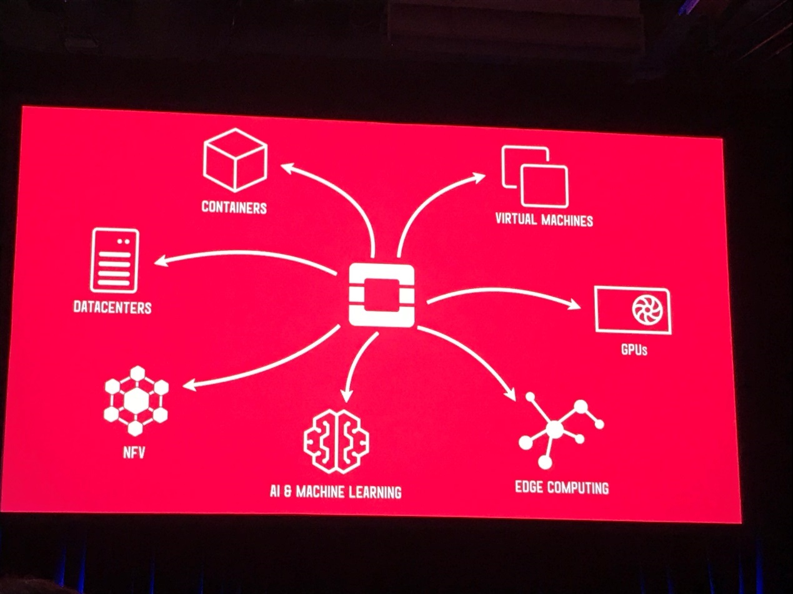

参与完整届峰会后，我们的最大感受是，OpenStack的内涵在被延展，从单一的云平台到基础设施层面，包括CI/CD、容器、边缘计算、HPC、NFV、公有云、私有云等。

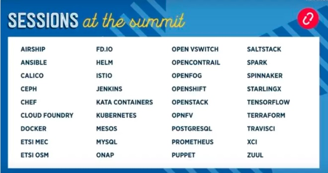

从Keynotes展示的各个议题，就已经能够看到此次峰会已经远远不止是OpenStack本身的展示了。OpenStack社区的视野早已扩展到了云计算相关的各个领域，从最基本的单项技术的发展以及与各开源组织的协同，到与业界各先进解决方案和新领域的融合等，社区都是以一种开放与包容的心态，来给各开源玩家们提供一个展示与交流的舞台。因此，OpenStack Summit更名为Open Infrastructure Summit，也就更易理解了。

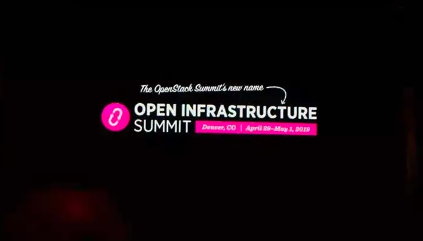

另外，从社区议题分布看，峰会上除了Nova有Cell、placement等影响较大的特性，仍有单独议题外，类似“OpenStack各组件XX特性介绍”等议题，现在几乎都绝迹了。这也另一方面，体现出社区早已跳出OpenStack单特性的展示，把更宝贵的分享时间留给了更有意义的议题，侧面的印证了Open Infrastructure Summit的命名。

### 2. NFV & 5G & 边缘计算

在NFV领域，今年最大的变化就是所有的议题都有提到边缘计算，在5G中MEC已经成为了必须要提供的解决方案。运营商更关注是否能够提供完整的解决方案及用户使用场景。

其中，在上届温哥华峰会上推出，10月底刚刚正式发布的StarlingX项目受到了业界的广泛关注。该项目是Intel和WindRiver基于电信云产品Titanium Cloud R5 为基础进行开源的，这个项目极大的促进了OpenStack产品化的能力。通过该项目能够非常简单的制作出一个OpenStack的发行版，极大的简化了OpenStack产品化的周期。让厂商能更进一步的聚焦于自身核心竞争力的开发。

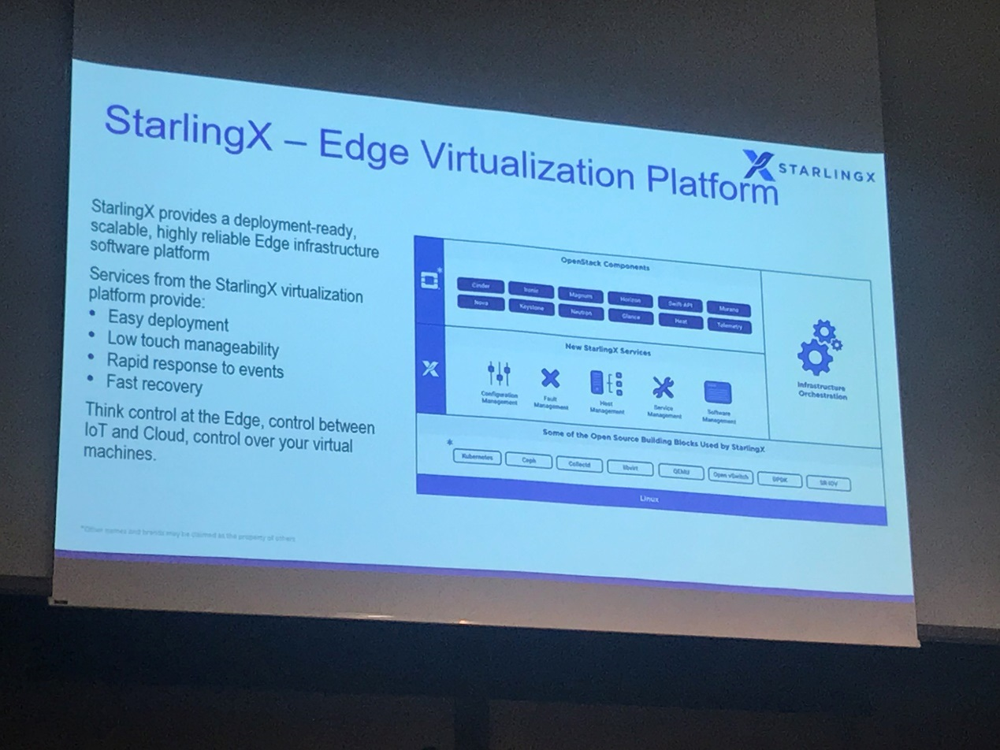

从议题上来看，MEC方案当前能够称的上是百花齐放。当前已有的解决方案就有Akraino/OpenCord/vCO等。中国联通，Intel和99 Cloud联合发表了《Comparison between Open Edge Projects (Akraino/StarlingX/OpenCord/vCO) modules v.s. ETSI MEC RA》的议题，认为Akraino关注于边缘计算的构建编译。OpenCord关注于边缘计算中的网络构成，使用XOS操作系统和ONOS控制器，vCO也关注于边缘计算中的网络构成，但是基于OpenDaylight控制器。每个方案中都有不同的侧重点。中国联通基于Acraino 设计了ETSI MEC RA，提出了自己对MEC的理解。

因此，由于以上方案基本还未成熟，还都未成为这一领域的事实标准。因此不少运营商也表示了对此的困扰。中国移动在其演讲中，通过介绍中国移动对多家5G产品的测试后，从运营商角度提出了不少对虚拟网元的看法，如何去选择OpenStack厂商以及边缘计算的理解。作为运营商，他们更期望厂商能够阐明各种使用场景，来为运营商提供完整的MEC解决方案。

### 3. 火热的 容器、AI、GPU

今天的议题中，和容器相关的议题也占了很大比重。

由OpenStack基金会管理在今年3月份OIC正式发布的Kata Containers项目，在第二天Keynotes上进行了重点展示。它是一个可以使用容器镜像以超轻量级虚机的形式创建容器的运行时工具，Kata Containers创建的不同容器跑在一个个不同的虚拟机（kernel）上，比起传统容器提供了更好的隔离性和安全性。同时继承了容器快速启动和快速部署等优点。Kata Containers符合OCI（Open Container Initiative）规范，同时还可以兼容K8S的CRI（Container Runtime Interface）接口规范。

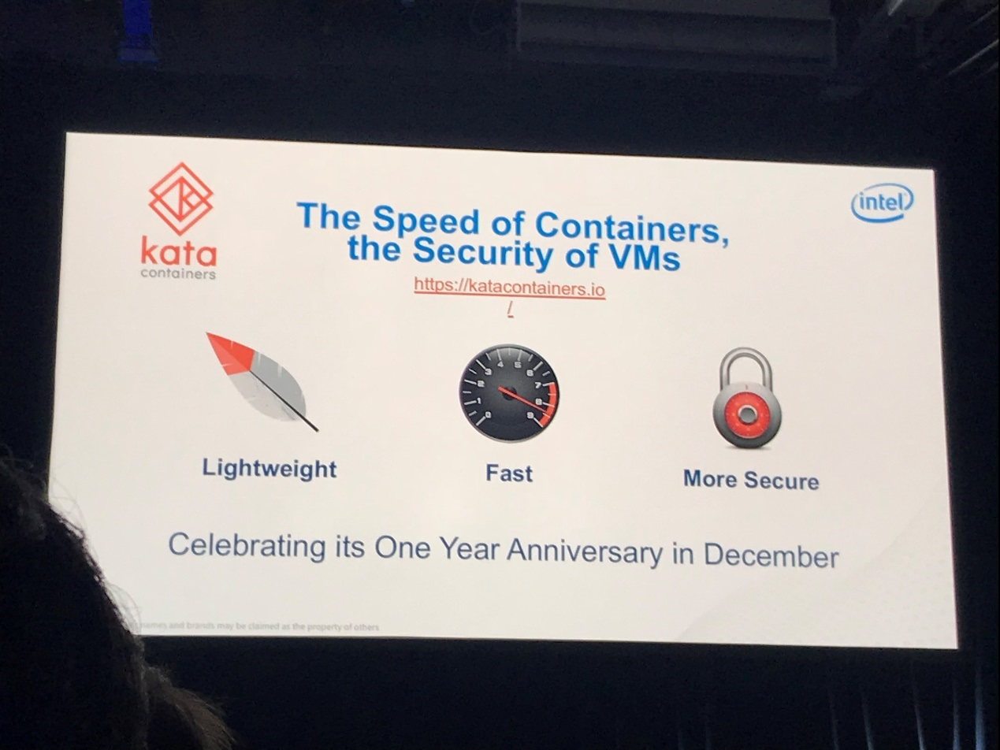

此外，有关OpenStack与K8s融合的议题，参与者也非常多。Red hat的一个在OpenStack与裸机上部署K8s的议题，就吸引了大量开发者前往聆听，可见大家对该领域的关注程度。

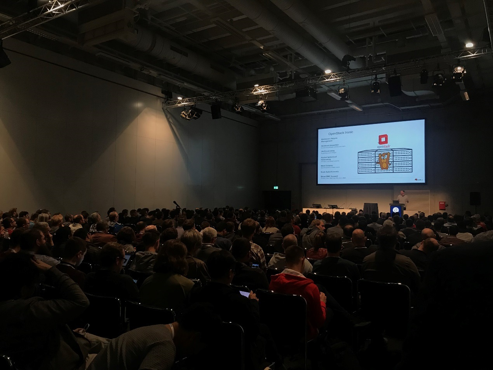

### 4. 原有项目的逐渐完善

在本次峰会上，虽然社区多次展示了OpenStack外延的持续扩展，但对于原有项目，OpenStack社区依然保持了很高的关注度。

在OpenStack项目中，Nova是一个成熟而复杂的项目。作为OpenStack两个创始项目之一，它伴随着整个OpenStack技术框架日趋成熟，Nova的稳定性和采纳程度都在持续攀升。同时，受人工智能、机器学习、NFV和边缘计算等用例的驱动，Nova也在与时俱进，不断吸纳新的技术。

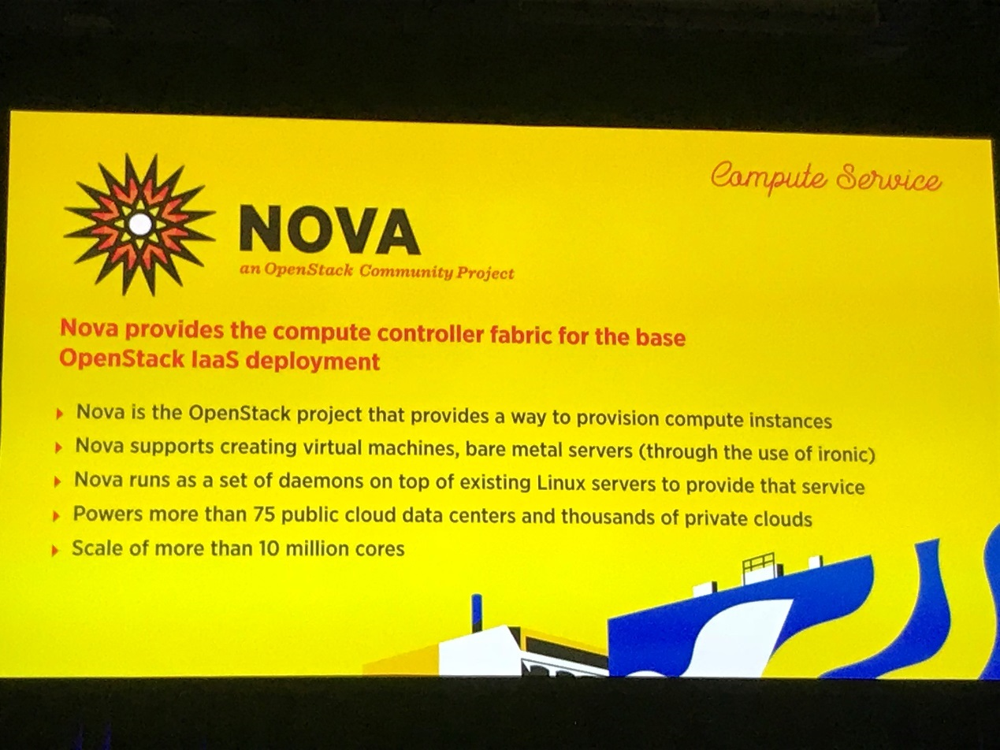

GPU加速器的Cyborg接口现在允许从OpenStack框架内访问和重新编程FPGA，包括用于以编程方式自动执行此操作的REST API。

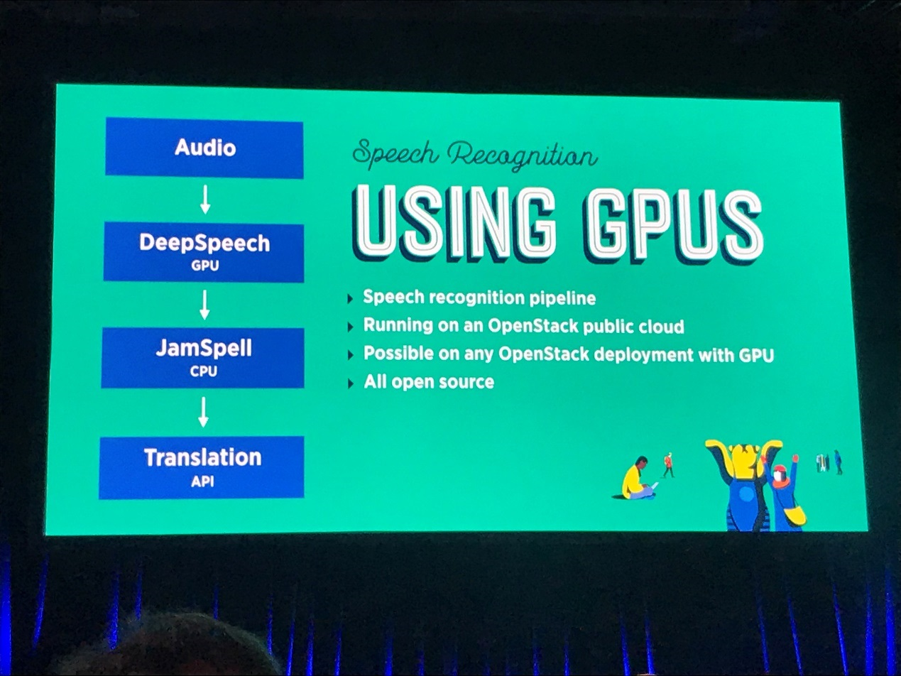

Ironic裸机控制器允许大规模集群将其镜像加载到主内存而不是本地存储，并且这将大大加快裸机服务器的部署。Ironic还具有控制物理服务器中BIOS设置的接口，并配置各种设置，例如SR-IOV外设总线虚拟化。现在雅虎大规模运行Ironic插件，管理着超过100万个内核，运行各种应用程序。Adobe拥有一个超过100000个核心的OpenStack云，由四个人运营——该公司表示，运行成本比公有云上的基础设施低30％。企业SaaS软件供应商Workday拥有一个50000核心的OpenStack集群，该集群正在扩展到300000个核心，以支持快速扩展的业务。

### 5. 周边生态建设

通过参加此次峰会，我们也看到了OpenStack周边项目的逐渐完善。从Ansible、Zuul、CI/CD等诸多实际案例分享中，我们看到了一个个整个生态的健康度在日渐提高。

作为当前广泛使用的开源存储方案Ceph，Ceph之父Sage也在此次峰会上，分享了在多云及混合云场景下的Ceph服务的新特性，整场议题干货满满，收到了大家的热烈掌声。

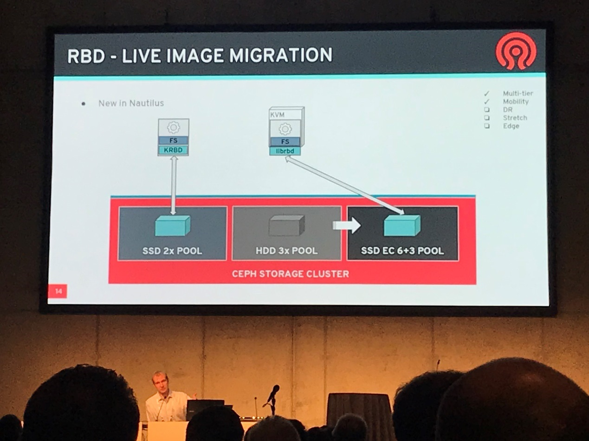

## 二、我在峰会：从旁听者到分享者

我之前陆续参与过几次峰会，一直作为一名旁听者。也曾想，如果自己站在台上，会不会紧张。。答案是，真的会！（笑）

经过前期资料投递及技术评审，我们获邀在大会场进行了主题名为《A Better VM HA Solution: Split-brain Solving & Host Network Fault Awareness》的技术演讲。通过详实的数据与流程讲解，充分展示了我们自有VM HA方案的基本原理与技术实现。这也是公司自有技术方案首次通过OpenStack峰会专业技术审核，并邀请与广大用户分享。来，笑一个（捂脸）\~

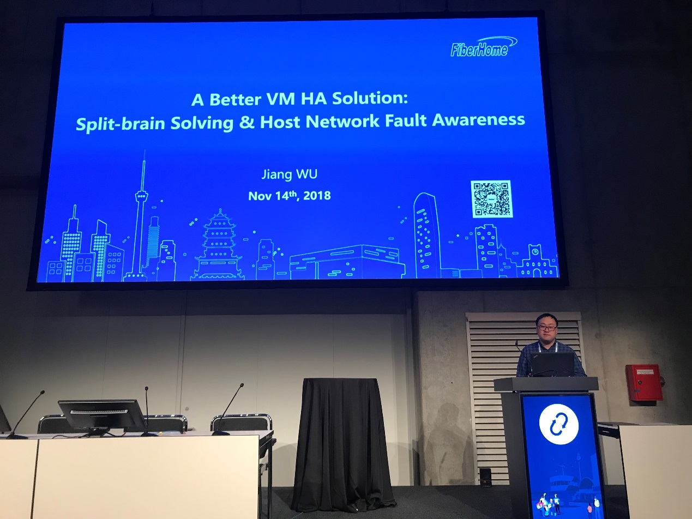

第一天到了会场踩点时，就发现我们的议题被安排在了CityCube里最大的三个演讲室之一。。我们的演讲安排在第二天下午4点20，全长40min。

整场演讲听众很多，用户参与反响热烈，多位听众还就部分技术问题当场进行了提问与沟通。整个演讲获得了广泛好评，结束时会场响起了热烈的掌声。

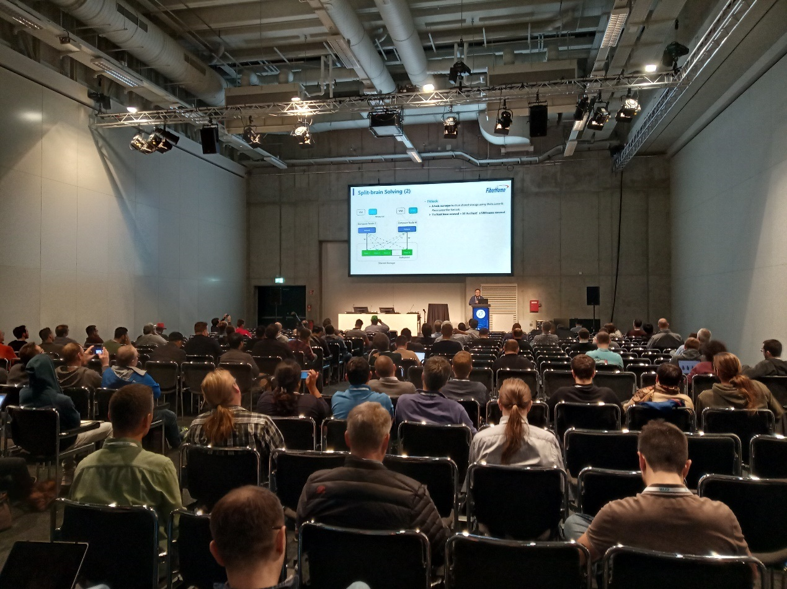

会后，我还和专程前来的Masakari项目PTL S.Priyankara及SIG技术Leader A.Spiers聊了聊，沟通了一些技术细节和问题。会后两位专家还邀请我们出席第二天的两场有关可靠性的相关演讲，分享彼此经验取长补短，我也荣幸的去参与了下，收获不少。

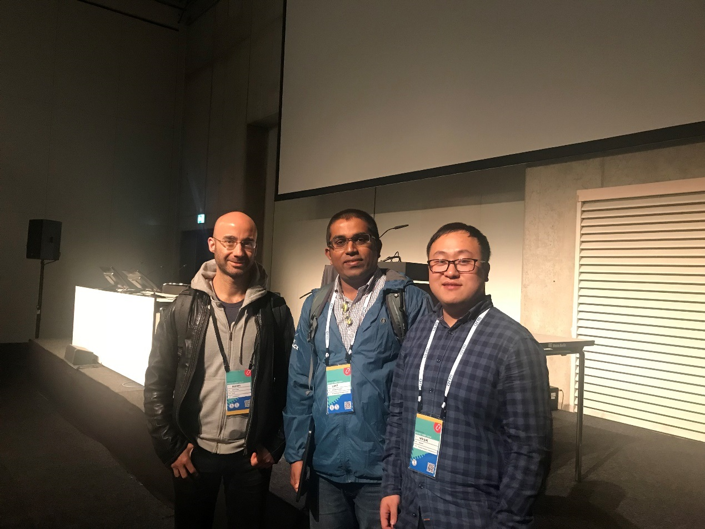

## 三、总结

### 1. 正经向

这次峰会，从各方面来说，都是OpenStack对之前发展的一次高度总结，既继承了已有的闪光点，同时又昭示了未来的道路。通过大家思想的交流与碰撞，每一位参会者都带走了自己的体会与感悟。而这些，也会成为一颗颗种子，在全球的土地上播种，收获。

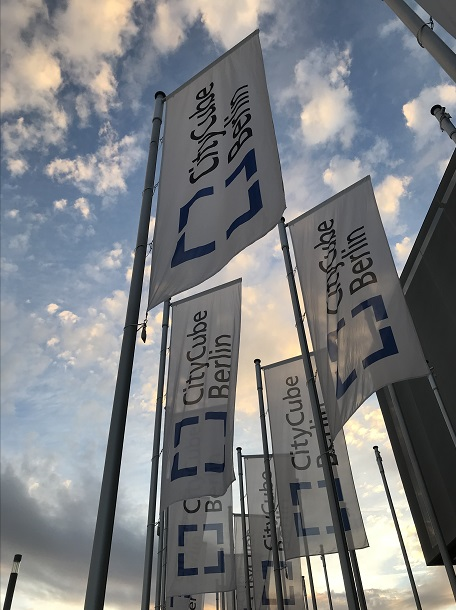

### 2. 不正经向

这次峰会的午饭冷餐简直了，实在是太难吃了。。严谨的德国人就不能在食物上多下点功夫么。。比上次在巴塞罗纳峰会上吃的还要凑合。。同行小伙伴吐槽说，是基金会没钱了不愿意买好的。来来来，直接上图，袋子里面是个贼硬还没啥味道的干面包：

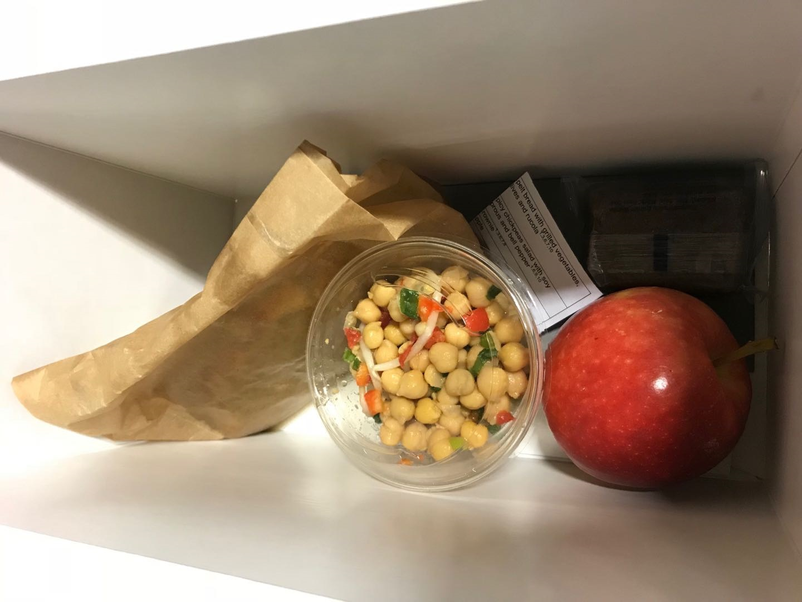

朋友吐槽说德国不是最有名是肘子么。好吧，最好用一张在德国大众点评上看到的评分前三的柏林肘子结束吧。话说这个德国肘子啊，由北派南派之说，以柏林和慕尼黑为代表。这个北派吧，讲究的是。。（略去3kloc。。）

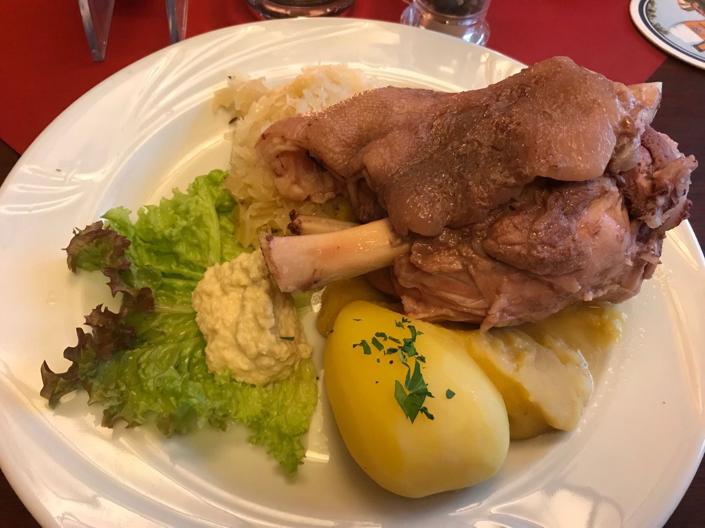
