# Cyborg 解析

Author: WingWJ

Date: 7th, Jan, 2019

Version: Rocky

<br/>

## 1. 概述

<br/>

### 1.1 背景

随着人工智能、机器学习、图像视频处理等领域的快速发展，用户对GPU的需求也日益剧增。截止目前，大多数用户仍会选择带有GPU的裸机服务器。然而，这同时意味着用户需要承担由配置此类设备所带来的管理性成本。如今，用户将能够使用vGPU驱动的虚拟机，并利用这部分资源运行人工智能相关的工作负载。

Cyborg项目就是应对这些对硬件加速设备的管理而应运而生。它目标在于解决当前OpenStack中对于加速器使用的种种不便之初，试图通过统一的服务框架，来提供一个统一的Vendor中立、Hypervisor中立的解决之道。

在开始认识Cyborg之前，我们以GPU为例，让我们先来看下当前OpenStack中是如何使用GPU的？

*注：文中部分资源来源于官网及峰会。*

### 1.2 当前GPU用法分析

经过逐个分析，会发现其实哪种方式都不太好使。。

- Bare metal
  - Production Ready
  - 通过裸机方式直接使用
  - 将有GPU诉求的工作负载直接分配给该主机
  - GPU只是主机的一个附属参数，无法进行管理
  - 多数场景下的选择
- PCI 直通
  - Production Ready
  - 不易管理。无统一工作流来控制这些加速设备
  - 不好用。需要通过主机组与PCI whitelist来配合完成，CPU与GPU调度分离易造成资源浪费
  - 少数场景下的使用选择
- vGPU
  - PoC only
  - 借助类似nvidia GRID等技术来实现
  - 当前需定制&KVM调优
  - BP正在做
- Cyborg
  - 进化ing

在体会了当前使用GPU的种种不易之后，让我们看看Cyborg的玩法。

<br/>

## 2. Cyborg 技术解析

<br/>

### 2.1 项目起源

Cyborg项目最早来源于ETSI NFV ISG以及OPNFV DPACC（Data Plane Acceleration）对设备加速设备的诉求。项目起步于2016年底，最初命名为nomad。该项目初始目标主要限于电信（Telco）领域，后面经过与社区等多方讨论，发现在HPC与公有云中都有对加速器的诉求，因此后续目标已经逐步扩展。如今的目标是致力于提供一套用于管理OpenStack中专用设备的服务框架。

Cyborg最终在OpenStack Queen版本中首次正式发布。

### 2.2 项目定位

这里先用一张图来概括Cyborg的作用：

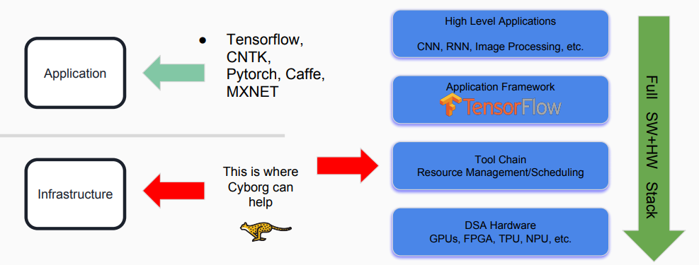

让我们对Cyborg负责的领域进行任务分解：

- 框架目标：加速设备的资源发现，生命周期管理
- 加速器类型：
  - 软件：dpdk/spdk（Storage Performance Development Kit）, pmem（Persistent Memory Programming）..
  - 硬件：FPGA, GPU, ARM SoC, NVMe SSD, CCIX based Caches, ..
- 特点：Vendor-neutral, Hypervisor-neutral
- 使用目标：可单独使用，也可与Nova、Ironic项目等配合

### 2.3 组件构成

以下是当前Cyborg的进程组成图：

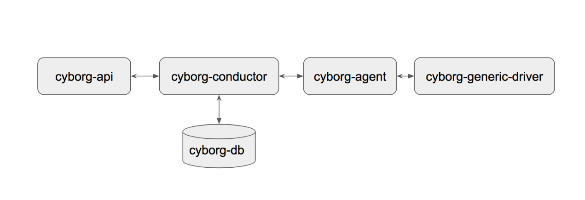

不管从部署形态与工作方式来看，Cyborg与Nova服务的关系很近。从架构图上也能看到cyborg与Nova的相似性。Cyborg遵从OpenStack的四原则，对外统一提供RESTful API，组件内通过RPC方式通信，组件间共享一个RDS。

以下大致罗列下各进程功能。注意，部分功能还未全部实现：

- cyborg-api：与其他OpenStack API服务一样，提供服务入口。与cyborg-agent及cyborg-db通过cyborg-conductor服务交互

- cyborg-conductor：类似nova-conductor。用于协调cyborg-api和cyborg-agent之间的交互与数据库访问

- cyborg-db：与其他组件一致的RDS

- cyborg-agent：类似nova-compute，主机上任务的实际执行者，通过Cyborg Driver与加速器后端进行交互，主要完成四部分工作，如下所示。此外，该进程还负责与Nova placement服务的通信

  - 数据上报：向Cyborg服务器报告有关可用加速器，状态和利用率的数据
  - 硬件发现：每隔数秒就会扫描实例的加速器和现有加速器的使用级别，并将这些信息通过心跳消息报告给Cyborg服务器，以帮助管理调度加速器
  - 硬件管理：管理安装驱动程序，依赖关系和卸载驱动。计划通过Ansible将用于管理每个加速器的配置文件和加速器的Driver。install和uninstall特定的ansible playbook适配Cyborg所支持的硬件。在管理的硬件上进行的配置更改将通过运行不同配置的playbook作为底层实现
  - 连接实例：一旦产生一个实例需要连接到主机上的特定加速器，Cyborg服务器将向Cyborg agent发送消息。由于不同加速器之间的连接方法不同，因此agent需要不同的driver提供连接功能

- cyborg-generic-driver：一种通用的多功能驱动程序，具有任何加速器都具有的通用功能集。从master代码分支上来看，目前只支持对SPDK和FPGA设备的操作。展开来说，该服务主要负责完成以下功能：

  - 识别和发现附加的加速器后端

  - 列出在后端运行的服务

  - 将加速器挂载（Attach）到通用后端

  - 从通用后端卸载（Detach）加速器

  - 列出附加到通用后端的加速器

  - 修改附加到通用后端的加速器

  - 当前master代码示例如下：

    ```
    standard_interfaces = ('discover', 'list', 'update', 'attach', 'detach')
    ```

### 2.4 部署形态

从部署形态上来看，cyborg-agent与cyborg-generic-driver一般部署在计算节点，其余位于控制节点。组件比较少，很容易想，我就不再画了。

是不和 Nova 很相似？

### 2.5 对象模型

因为Cyborg各加速器最终需要通过Nova来体现，即GPU、FPGA等与vCPU、内存等一样，都是一种资源形式。因此，我们Cyborg项目中各对象，最终都会通过placement中的对象来体现。

以下，让我们从placement视角来重新审视这些资源。我们同样使用RP和RC来定义这些加速资源：

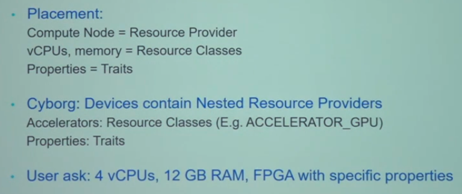

具体对象模型与placement的对应：

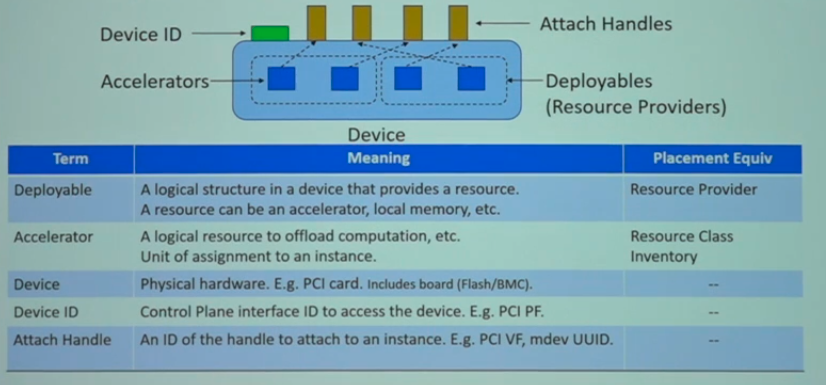

注意，一个设备可能有多个子设备。在GPU场景下一般只有一个，但在FPGA下可能会分为多个Region，可以分别来控制（事实上，每个region还能够再分为多个加速器）。参考以上定义，在GPU场景下，每个vGPU就能够视为独立的加速器单元，即一个accelerator。

使用示例：


### 2.6 与Nova的交互

有了上一节中Cyborg对象和placement中模型对应的基础，我们就可以串起来整个使用流程了。让我们看下如何通过Nova直接创建一个带有加速器的VM。

*注：与Nova的交互在Rocky版本中仍未全部完成，当前计划在Stein实现。*

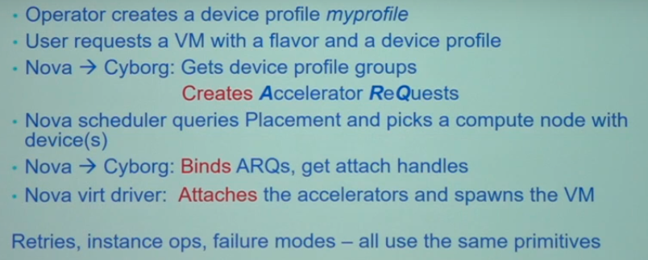

其中，创建加速器类似于Nova向Neutron请求port的过程。其中，device profile同上图中对应模型，形如以下形式，整体交互流程图绘制如下：

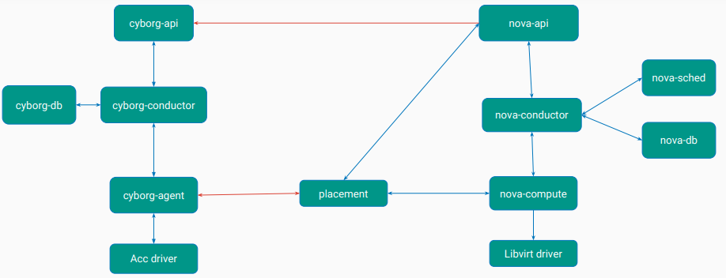

### 2.7 对外接口

当前提供的接口如下。（注：官网文档中只有accelerators相关接口，还未更新。已提交patch修改ing）

```
Verb     URI                                        含义
-------- ------------------------------------------ ------------------------------------
GET      /accelerators                              查询加速器列表
GET      /accelerators/{uuid}                       指定uuid查询加速器
POST     /accelerators                              创建一个加速器
PUT      /accelerators/{uuid}                       指定uuid更新加速器参数
DELETE   /accelerators/{uuid}                       指定uuid删除加速器

GET      /accelerators/deployables/                 查询加速器设备列表
GET      /accelerators/deployables/{uuid}           指定uuid查询加速器设备
POST     /accelerators/deployables/                 创建一个加速器设备
PATCH    /accelerators/deployables/{uuid}           指定uuid来更新加速器设备信息
PATCH    /accelerators/deployables/{uuid}/program   指定uuid对加速设备（fpga）进行编程
DELETE   /accelerators/deployables/{uuid}           指定uuid删除加速器设备
```

### 2.8 数据表结构

当前Cyborg项目一共包含五张表，分别是Accelerator, Deployable, Attribute, QuotaUsage, Reservation，其中最关键的是前两张表。对应关系可以通过下文的索引关系来体现，建议结合下一节的数据模型来理解。

```
class Accelerator(Base):
    """Represents the accelerators."""

    __tablename__ = 'accelerators'
    __table_args__ = (
        schema.UniqueConstraint('uuid', name='uniq_accelerators0uuid'),
        table_args()
    )

    id = Column(Integer, primary_key=True)
    uuid = Column(String(36), nullable=False)
    name = Column(String(255), nullable=False)
    description = Column(String(255), nullable=True)
    project_id = Column(String(36), nullable=True)
    user_id = Column(String(36), nullable=True)
    device_type = Column(String(255), nullable=False)
    acc_type = Column(String(255), nullable=True)
    acc_capability = Column(String(255), nullable=True)
    vendor_id = Column(String(255), nullable=False)
    product_id = Column(String(255), nullable=False)
    remotable = Column(Integer, nullable=False)


class Deployable(Base):
    """Represents the deployables."""

    __tablename__ = 'deployables'
    __table_args__ = (
        schema.UniqueConstraint('uuid', name='uniq_deployables0uuid'),
        Index('deployables_parent_uuid_idx', 'parent_uuid'),
        Index('deployables_root_uuid_idx', 'root_uuid'),
        Index('deployables_accelerator_id_idx', 'accelerator_id'),
        table_args()
    )

    id = Column(Integer, primary_key=True)
    uuid = Column(String(36), nullable=False)
    name = Column(String(255), nullable=False)
    parent_uuid = Column(String(36),
                         ForeignKey('deployables.uuid'), nullable=True)
    root_uuid = Column(String(36),
                       ForeignKey('deployables.uuid'), nullable=True)
    address = Column(String(255), nullable=False)
    host = Column(String(255), nullable=False)
    board = Column(String(255), nullable=False)
    vendor = Column(String(255), nullable=False)
    version = Column(String(255), nullable=False)
    type = Column(String(255), nullable=False)
    interface_type = Column(String(255), nullable=False)
    assignable = Column(Boolean, nullable=False)
    instance_uuid = Column(String(36), nullable=True)
    availability = Column(String(255), nullable=False)
    accelerator_id = Column(Integer,
                            ForeignKey('accelerators.id', ondelete="CASCADE"),
                            nullable=False)
```

<br/>

## 3. Cyborg 项目展望

<br/>

### 3.1 架构演进

以下是Cyborg项目最新的架构演进图。包含在之前以及之后版本演进中逐步添加的各功能组件。


### 3.2 近期BP分析

- Rocky
  - Quota 支持
  - 完成标准化API
  - 支持对FPGA比特流编程
  - 与placement 配合调度
- Stein
  - Cyborg API支持RBAC
  - 继续完成与Nova的交互
    - ARQ、device profile
    - Placement API 交互
  - Os-acc：为挂载卸载加速器提供抽象方法
  - 新驱动支持
    - Xilinx FPGA driver
    - HUAWEI NPU
    - RISC-V driver

具体BP都能在官网找到：[*https://docs.openstack.org/cyborg/latest/specs/index.html*](https://docs.openstack.org/cyborg/latest/specs/index.html)

### 3.3 Cyborg in OpenStack

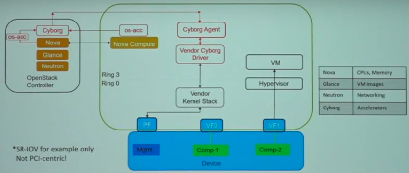

注意：Nova不直接调用Cyborg API，而是通过os-acc（类似Nova调用Cinder时使用的os-brick库，以及使用网络时的os-vif）来进行交互。

### 3.4 与ovs-dpdk的配合（计划）

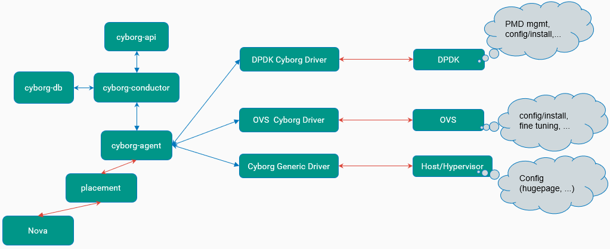

### 3.5 与容器的配合（计划）

计划是将Cyborg的数据模型，统一于K8s的DPI（Device Plugin Interface），这样就可以将这些加速设备暴露给容器来使用。此外，Cyborg后续可能还会提供用于CRD（Custom Resource Definition) 的加速器控制器，目前还在构想中。

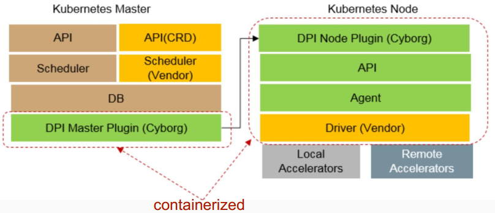

<br/>

## 4. Cyborg 社区分析

<br/>

### 4.1 近期动态

在去年底的OpenStack Berlin Summit上，keynotes中提到的GPU等硬件利用的新趋势。此外，在Nova及其他社区讨论中，都有涉及Cyborg的相关内容。对于一个新项目来说，还是有不少关注度的。

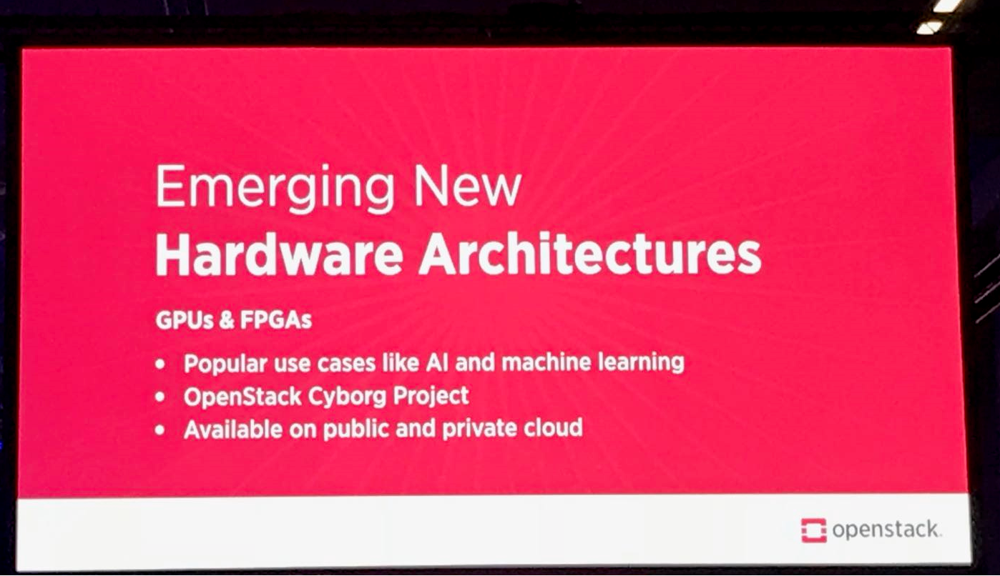

### 4.2 代码贡献分析

当前Cyborg项目Review团队共有9为core reviewer，其中6位为国人。

在当前Stein版本中，参与公司如下：

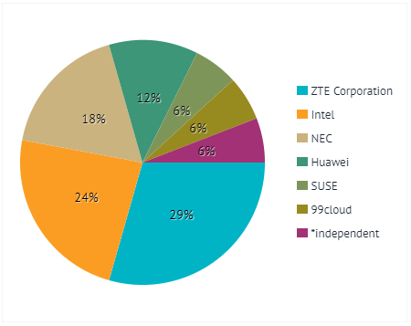

但是总的提交数在Stein版本真的很少，只有17个。分布如下：


下图为最近的提交详情，近期的提交数也很低。我最近也试着先提交了几个文档Patch，还一直处于没人理的状态。。

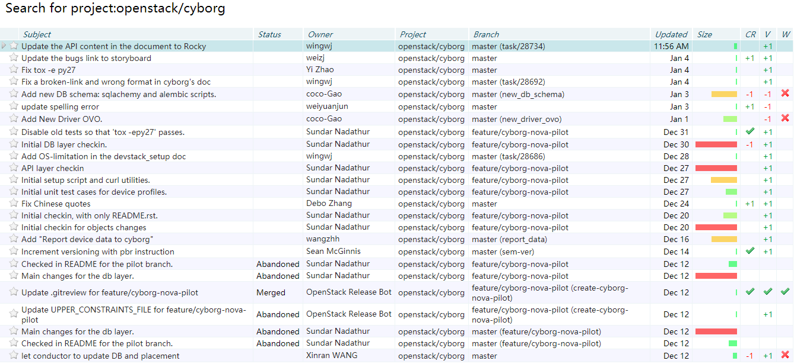

<br/>

## 5. Cyborg 价值评估

当前项目暂不成熟，整体代码量也不大，项目使用与运维所必须的CLI、portal、文档等配套资源也都暂不成熟，目前与Nova的整合也尚未完成（计划在Stein实现）。部分特性暂时处于画饼状态。。近期社区贡献度也有所下滑（可能也和临近新年有关）。不过我觉得该项目前景不错，后续也会继续研究下。结合当前越来越多的加速器场景诉求，也希望Cyborg能吸引到更多的人/厂家投入。

<br/>

## 附录

- Wiki：*https://wiki.openstack.org/wiki/Cyborg*
- IRC：freenode\#openstack-cyborg
- Codes：[*https://review.openstack.org/#/q/project:openstack/cyborg*](https://review.openstack.org/#/q/project:openstack/cyborg)

- Summit：[*https://www.openstack.org/videos/search?search=cyborg*](https://www.openstack.org/videos/search?search=cyborg)

