# Keystone多级租户及配额 能力解析


## 概述

随着OpenStack项目逐步发展，其支持项目已从小型的数据中心走向更大规模的部署/应用场景。在一些大型项目中，常见到类似VDC等概念，需要整个组织级别能够逐级细分，并且要求各级组织间能提供严格的ACL控制与配额管理能力。

Keystone作为OpenStack中提供统一身份认证管理的组件，自Diablo版本发布以来，从仅支持小的扁平的租户组织架构，到v3版本引入Domain/Group等概念，逐步在完善分级管理的能力。

那么，面对日渐复杂的分级诉求，其支持能力如何呢？下文结合一个需求案例，来具体分析下当前Keystone对于多级租户管理的支持度。


## 需求案例

某IT公司包含几个部门，每个部门下又有数个科室，要求资源能够逐级分配；且公司级运维管理员能够对部门资源进行管理，而部门管理员需要对科室资源执行部分操作。

分析以上需求描述中，包含了三层诉求：

1. 一是要求云平台能够提供多级租户设置，且其深度能够满足细分需求；
2. 二是要求能够对各级管理员相关权限进行分别指定；
3. 三是逐级分配诉求中，隐含了对于配额继承/共享的要求；即资源是分给整个部门的，而整个部门除自己预留的部分外，剩余的资源可再分配到不同的科室去。

以上内容对应到OpenStack中，可大致转化为以下模型：

```
   +---------------------------------+
   |                                 |
   |          +---------+            |
   |          |  Prj_0  |            |
   |          +---------+            |
   |          |quota=100|            |
   |          +---------+            |
   |              /\                 |
   |             /  \                |
   |            /    \               |
   |           /      \              |
   |          /        \             |
   |    +---------+  +---------+     |
   |    | Prj_1_a |  | Prj_1_b |     |
   |    +---------+  +---------+     |
   |    |quota=50 |  |quota=20 |     |
   |    +---------+  +---------+     |
   |          /\                     |
   |         /  \                    |
   |        /    \                   |
   |       /      \                  |
   |      /        \                 |
   | +---------+  +---------+        |
   | | Prj_2_a |  | Prj_2_b |        |
   | +---------+  +---------+        |
   | | quota=8 |  |quota=10 |        |
   | +---------+  +---------+        |
   |                                 |
   +---------------------------------+
```

下文针对这三点诉求，基于OpenStack Ocata版本，采用实际操作来求证下，之后根据验证结果来给出具体解析。


## 多级租户支持

这里先验证下多级租户的支持度。

陆续指定各租户的从属关系，逐个创建新租户。可见，当创建到第6层时提示已达最大层级深度。

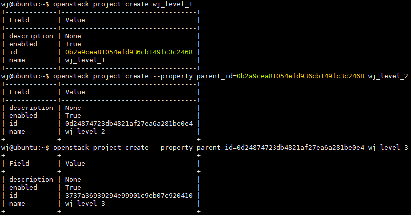

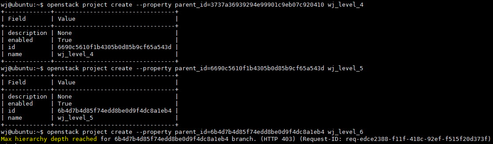

简单说明下：

1. Keystone 中对于多租户的递归深度，考虑功能与性能平衡，默认设定为5层；
2. 可以通过修改配置项"max_project_tree_depth"来自定义。

 可见，多级租户设置这里，是能满足需求的。


## 权限设置

按照之前需求，这一部分需要能够针对不同层级的管理员，提供不同的操作能力。

这一部分与Policy有关，当前OpenStack中规则管理还是分散在各组件"policy.json"中，需根据角色来指定对应规则。这一部分本文不展开。


## 多级配额支持

有了之前的验证基础，还剩多级配额的相关功能需要验证下。同样先在环境上实际验证下。

#### 1. 准备两个租户，指定父子关系：

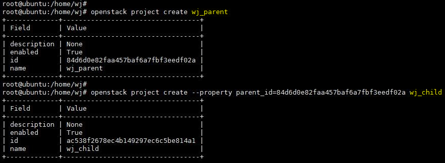

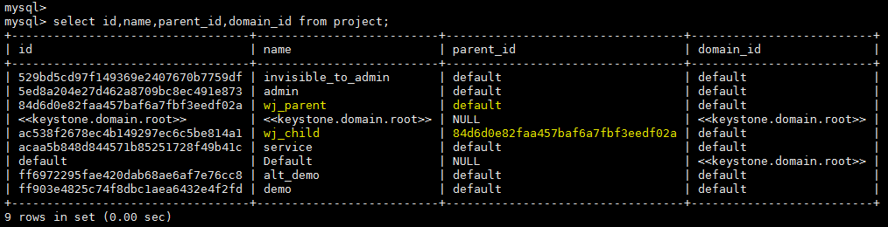


可见，租户不指定domain时默认同为default。且：

1. 无父租户的Project，其父租户是默认domain；

2. 有父租户的Project，其父租户即指定的父租户。

   ​


#### 2. 分别在两个租户内创建两个用户：

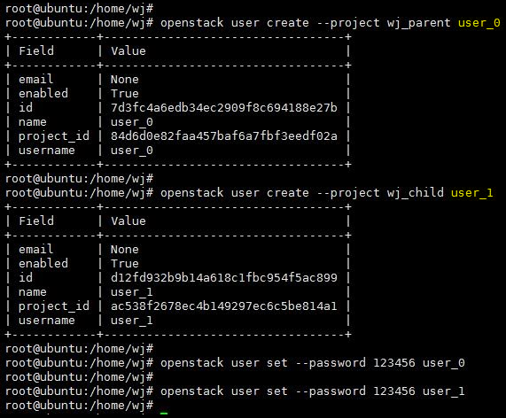


#### 3. 设置角色：

将父租户中的用户，在子租户中也设置为"admin"角色。

*注：当前版本OpenStack CLI 移除了之前的"inherited"选项，需要单独指定下。*

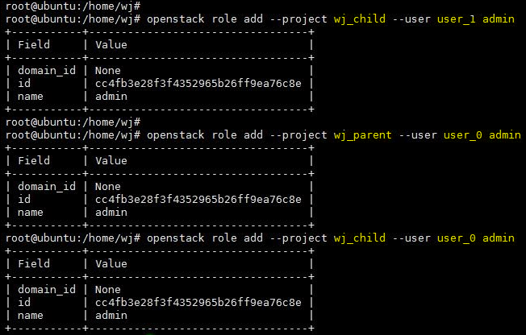

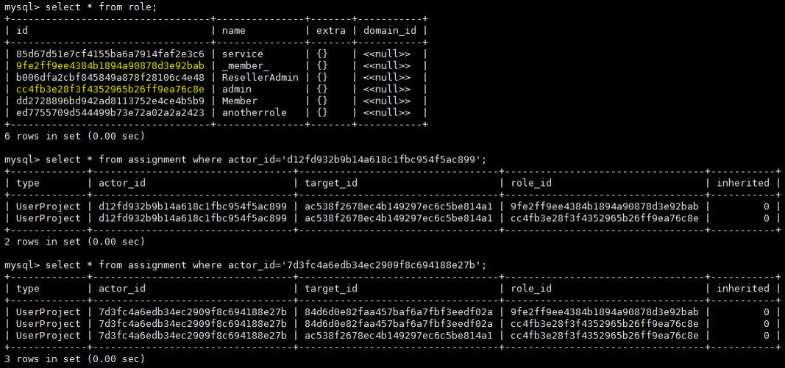


#### 4. 设置父租户的配额：

这里选取keypair为实验对象：


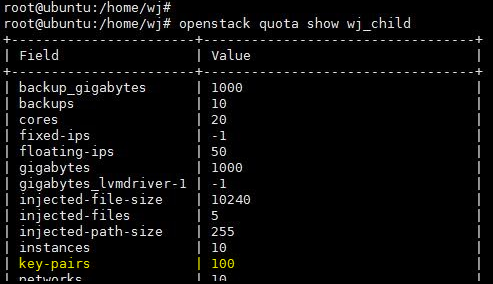

将父租户的keypair 配额限定为1。而子租户keypair配额保持100不变。


#### 5. 在子租户内创建资源：

先使用父租户管理员用户，在子租户内尝试创建keypair：


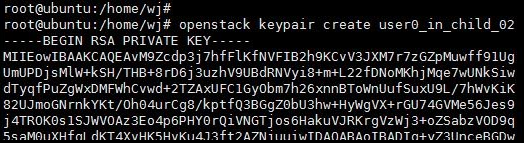

在子租户内创建两个keypair，结果成功。——**似乎说明子租户的资源与父租户独立，父租户配额限制不影响子租户。**


#### 6. 在父租户内创建资源：

切换回父租户，重新创建keypair：

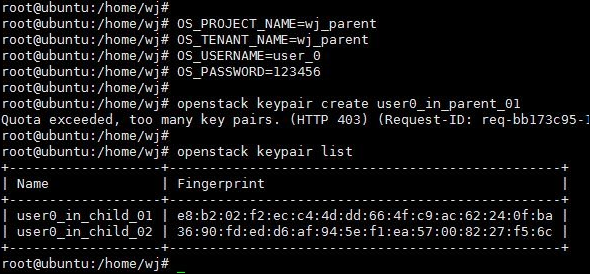

在父租户内创建keypair，直接提示配额不足。且通过查询接口，在父租户内能够查询到之前父租户管理员用户在子租户内创建的两个keypair。——从结果来看，**似乎说明父租户的资源配额，是会包括子租户资源的。**


#### 7. 扩容父租户的配额，测试父租户能否为自身再预留部分资源：

首先将父租户配额修改为3：


在父租户内继续创建keypair：

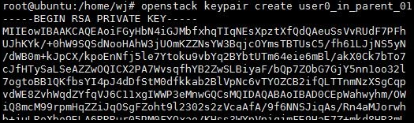

再次创建第二个keypair 时，就会提示超过配额。调用查询接口，可以看到当前能够查到的keypair为3，符合配额限制：

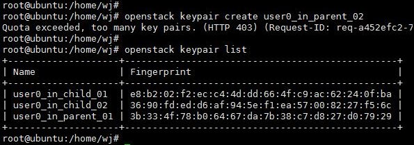


#### 8. 疑问：

根据上文测试结果，总结下上面的判断行为为：

1. 父租户配额不影响子租户配额；
2. 而子租户配额，却会影响父租户配额。

不过仔细想想，这里是**只"底层影响上层的配额"，感觉和一般理解的控制流方向相反，逻辑似乎不太对？**


#### 9. 回到子租户，切换子用户重新创建：

回到我们的测试场景。

先删掉之前父租户管理员用户在子租户内创建的keypair。之后回到子租户，切换到子租户管理员用户来重新测试：

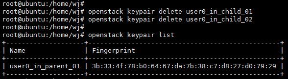

重新在子租户内创建两个keypair：

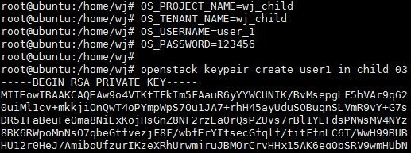

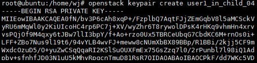


#### 10. 在父租户内再次创建：

接着，我们回到父租户用户，再次查看下当前父租户资源用量。见下图，可见当前仅能看到最开始时，父用户自己创建的一个keypair，而子用户刚在上一步创建的两个keypair 却看不到了：

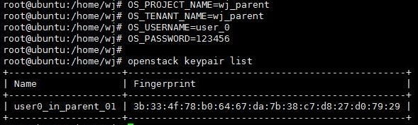

陆续创建两个keypair后，再创建第三个后才提示失败，满足配额预期。

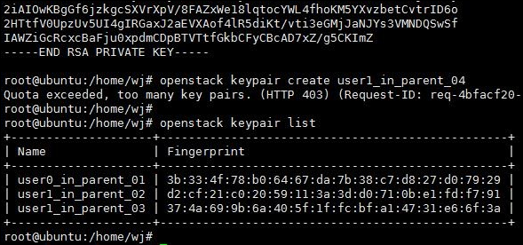


#### 11. 二次疑问：

综上，第二次与第一次的结果，似乎截然相反。

**按照这次的测试结论，应该是——父子租户间配额互不影响，彼此独立。**看上去，似乎第二种更符合逻辑些。

***那么，这里究竟哪种正确呢？***


#### 12. 释疑：

这里解释下，为何会出现以上两种现象。

答案其实是，**keypair 在Nova中是按照用户名来查询，而不是租户**。因此：

在第一次中：

1. 用父用户在子租户内创建资源时，实际统计时是采用发送消息的租户来判断配额的，即子租户配额，由于默认值是100，因此不会超配；
2. 而在回到父租户时，再次判断配额时就会提示配额已满，因为父租户的配额仅为1。

 而在第二次：

1. 由于直接使用的是子租户创建的keypair，在回到父租户中查询时使用父用户查询，是查询不到的，因此也不会占用父租户的配额；
2. 直到父用户本身在父租户中创建的keypair 超过配额，才会报错。

综上，归根结底，以上现象是由于keypair 在Nova中的特殊性造成的。

其实，对于虚拟机等普通对象来说，**父子租户间的配额都是互不影响，彼此独立的。**


#### 13. 附加测试

下面拿虚拟机试试。

首先在父租户中创建一个虚拟机。之后切换到子租户中，分别用两个用户查询虚拟机，发现都看不到：

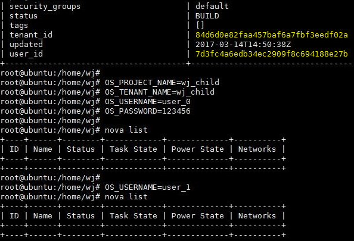

之后在子租户中使用子用户创建虚拟机，然后切换回父租户，发现也只能看到最开始的那个，新虚拟机也看不到。

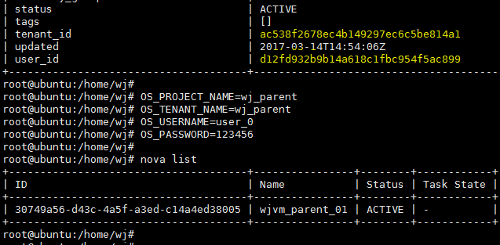

最后在子租户中，使用父租户管理员用户创建一个虚拟机，之后返回父租户，继续使用原用户查询，发现依然看不到：

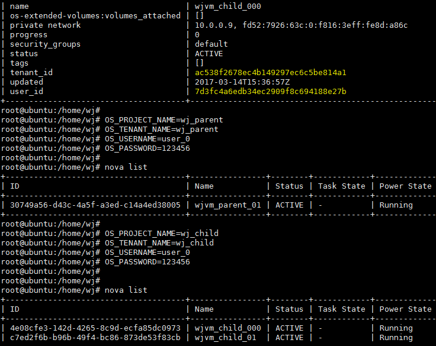

可见，虚拟机对象是与我们之前预期一样，是仅按租户来区分权限的。


## 社区现状：

说到这里，就顺便聊聊Keystone 社区有关多级租户相关的发展现状。


### Keystone多级租户支持

有关Keystone多级租户设置，以Domain-Project 为基本结构的嵌套模型，租户权限部分已经实现。

1. 权限分层之前早已完成：[https://blueprints.launchpad.net/keystone/+spec/hierarchical-multitenancy](https://blueprints.launchpad.net/keystone/+spec/hierarchical-multitenancy)
2. 顶级Project 作为Domain，Mitaka已实现：[https://blueprints.launchpad.net/keystone/+spec/reseller](https://blueprints.launchpad.net/keystone/+spec/reseller)
3. Horizon 支持，去年底也已标示为完成：[https://blueprints.launchpad.net/horizon/+spec/hierarchical-projects-and-inherited-assignments](https://blueprints.launchpad.net/horizon/+spec/hierarchical-projects-and-inherited-assignments)


### 各组件的多级配额支持

而本文最关心的，各大组件配额嵌套的问题，其实社区之前就将BP同步给各个组件了。不过之前仅Cinder完成了，Nova的BP几个版本都没提进去已废弃，而其余模块甚至都还没开始动。

不过，社区近期已开始关注相关议题。在今年2月底的首届OpenStack PTG（The Project Teams Gathering）上，Nova专门就Quota分级进行了讨论，新的BP在去年底也已重新提出，相关组件功能设计已经开始快速推进。

具体信息汇总如下：

1. [https://blueprints.launchpad.net/nova/+spec/nested-quota-driver-api](https://blueprints.launchpad.net/nova/+spec/nested-quota-driver-api) 
2. [https://blueprints.launchpad.net/cinder/+spec/cinder-nested-quota-driver](https://blueprints.launchpad.net/cinder/+spec/cinder-nested-quota-driver)
3. [https://blueprints.launchpad.net/glance/+spec/nested-quota](https://blueprints.launchpad.net/glance/+spec/nested-quota)
4. [https://blueprints.launchpad.net/neutron/+spec/nested-quota-driver](https://blueprints.launchpad.net/neutron/+spec/nested-quota-driver)
5. [https://review.openstack.org/#/c/284454/](https://review.openstack.org/#/c/284454/)
6. https://blueprints.launchpad.net/nova/+spec/hierarchy-quota-driver


### Keystone多级租户的后续计划

此外，有关分级管理的其他功能，Keystone在Pike版本的规划如下，此处一并附上：

1. Project 递归删除/禁用，Spec已批准，正在实现中：[https://blueprints.launchpad.net/keystone/+spec/project-tree-deletion](https://blueprints.launchpad.net/keystone/+spec/project-tree-deletion)
2. Domain分级，Spec 需重新提交：[https://blueprints.launchpad.net/keystone/+spec/hierarchical-domains](https://blueprints.launchpad.net/keystone/+spec/hierarchical-domains)
3. 子租户是否继承父租户，Spec 需重新提交：[https://blueprints.launchpad.net/keystone/+spec/inherit-from-parent](https://blueprints.launchpad.net/keystone/+spec/inherit-from-parent)
4. Limits API 讨论稿：[https://review.openstack.org/#/c/455709/](https://review.openstack.org/#/c/455709/)


## 结论

1. Keystone 在Mitaka版本已支持多级租户设置，最大嵌套层级默认为5；

2. 但多级各租户间的配额关联还未实现，父子租户间配额独立；

3. 因此，若想实现类似"省市县"的多级管理，且要求配额统分功能的话；**在不修改Keystone代码的前提下**，建议采用如下方式实现：

   1. Portal 独立控制：各租户配额在OpenStack各组件层面放开；
      - 优点：更灵活，与OpenStack解耦，后续社区补完后易于切换；
      - 缺点：
        - Portal 需独立维护配额信息；
        - 无法支持API等对接方式，功能特性需与Portal 配合实现。
   2. 配额由各组件控制：各子租户独立发放业务，父租户单独指定本租户内的配额（不包括子租户的）能够使用的：
      - 优点：
        - Portal 无需维护配额信息，与OpenStack解耦；
        - 部署简单，结构清晰；子租户扩容时无需修改父租户配额；
      - 缺点：
        - 父租户配额无法显示子租户配额之和。
   3. 基本方案同方案2，只是(父租户配额) = (子租户配额之和 + 父租户本身配额)：
      - 优点：
        - Portal 无需维护配额信息，与OpenStack解耦；
        - 父租户配额能够直接显示整个上下级组织的配额总数，父子租户间资源无实际隔离，利用率高；
      - 缺点：
        - 部署时稍显复杂，后续子租户扩容时需同步配额改动到父租户；
        - 且由于租户间其实未实现真正的资源配额隔离，因此当父租户如果占用过多资源时，各子租户资源将无法达到预先计划的配额值（即比各自配额实际承诺的少了）。
   4. 配额仍由各组件控制：但在父租户中专门创建一特权用户，该用户在父租户内无操作权限，但在各个子租户内可操作资源用于发放业务。之后按照"省市县"实际资源要求，保证各子租户配额之和，不超过父租户配额即可：
      - 优点：
        - Portal 无需维护配额信息，与OpenStack解耦；
        - 父租户配额能够直接显示整个上下级组织的配额总数，父子租户间资源无实际隔离，利用率高；
      - 缺点：
        - 部署时配置困难，后续子租户扩容时得同步修改父租户内配额；
        - 另外各个租户都需使用该租户发放业务，会约束交付场景；
        - 在子租户中使用该用户查询Keypair 时，会查到其他该特权用户在其他租户中创建的Keypair；
        - 且由于租户间其实未实现真正的资源配额隔离，因此当父租户如果占用过多资源时，各子租户资源将无法达到预先计划的配额值（即比配额实际承诺的少了）。

4. 鉴于后续社区发展和现状分析，**个人更推荐方案二和方案一**。

   ​