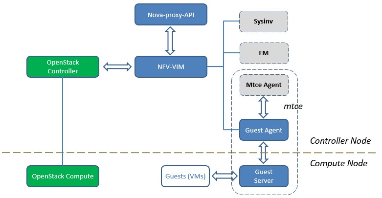
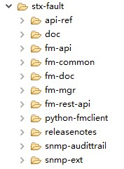
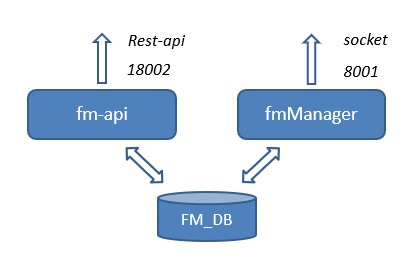
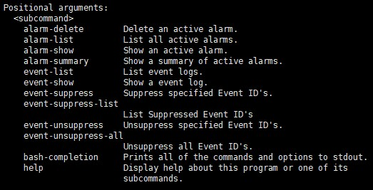
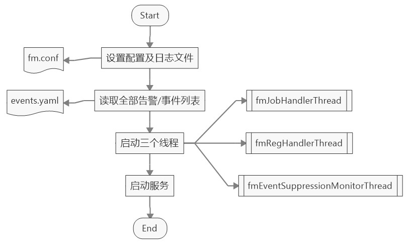
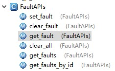
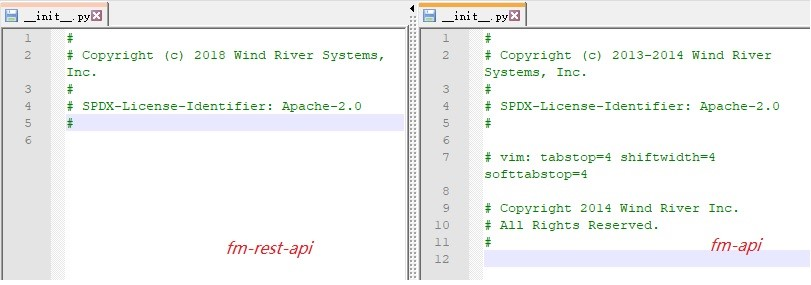
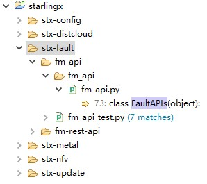
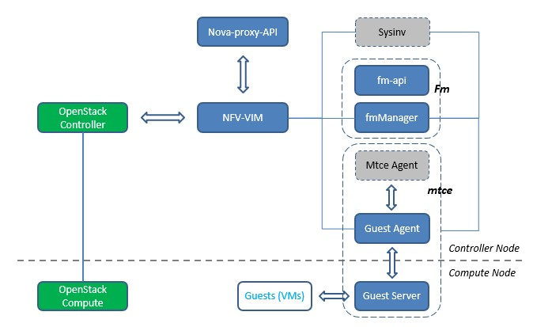

#庖丁解牛——StarlingX 技术详解（2. stx-fault篇）

Author: WingWJ

Date: 26th, Feb, 2019

StarlingX version: 23rd, Jan, 2019

##一、引言

接着上一篇 [stx-nfv 项目技术详解](https://github.com/wingwj/wingwj.github.io/blob/master/sharing/starlingx/stx_nfv.md)，这一节来看stx-fault 项目。

入题以前，先温习一下之前（已涉及到组件）的StarlingX 架构图（局部），如下图。本篇的目标在于把右上角的FM组件，完全拆解清楚。



##二、stx-fault project 详解

###1. 项目概述

stx-fault，诚如其名，是StarlingX 项目中用于告警及事件处理及上报的项目，功能由FM组件来承接。与之前研究stx-nfv 一样，先来看下stx-fault 实现的功能。这里摘录原文，理解准确些：

-   Framework for infrastructure services via a client API to:

    -   Set, clear and query customer alarms.

    -   Generate customer logs for significant events.

-   Framework maintains an Active Alarm List.

-   Active Alarm Counts Banner on Horizon GUI.

-   Framework provides REST API to query alarms & events and also publish through SNMPv2c Traps.

-   Support for Alarm suppression.

-   Operator Alarms:

    -   On Platform Nodes & Resources.

    -   On Hosted Virtual Resources ( i.e. VMs, Volumes, Networks).

-   Operator Logs - Event List:

    -   Logging of Set/Clears of Alarms.

    -   Related to Platform Nodes & Resources.

    -   Related to Hosted Virtual Resources ( i.e. VMs, Volumes, Networks).

###2. 业务流程解析

这里开始stx-fault 的具体解析。

####2.1 开头的两点疑问

先来看看stx-fault 的包结构：



首先，这里产生一个疑问，**怎么有fm-api 与fm-rest-api 两个api相关包？两者又有什么区别？**——这个稍后解释，先来看看FM相关进程。

FM服务主要由两大进程提供，分别是fm-api 和 fmManager：

-   fm-api：rest-api基于Pecan框架，端口号18002，默认启动16个子进程；

-   fmManager：端口号8001。是FM实际提供告警、事件等故障处理能力的核心组件。

把这两个进程画到一张图里。如下：



看上面这张架构图，是不觉得有点奇怪。**怎么fm-api 与fmManager 之间，没有交互？**——这个问题作为疑问二。

下面开始整个FM的具体技术分析。计划以这两个服务启动为引子，来逐步串联起stx-fault 的核心内容，并回答开始的这两点疑问。

####2.2 fm-api 服务启动

先看看fm-api 进程。这部分，其实对应于fm-rest-api包，python实现。它是一个标准的wsgi服务，基于pecan框架对外提供rest-api。启动入口在 stx-fault/fm-rest-api/fm/fm/cmd/api.py中的main() 方法。

FM对外提供的全部rest接口，可在 stx-fault/api-ref/source/api-ref-fm-v1-fault.rst 中看到。当然，直接看官网API更直观：*https://docs.starlingx.io/api-ref/stx-fault/api-ref-fm-v1-fault.html*。仔细看下这些接口，其实fm-api对外只提供了一些查询类操作，以及基于告警之上的功能（如事件及抑制）；接口查询直接通过调取dbapi获取（或者换句话说，从fm-db）。

通过python-fmclient 提供的CLI，能够更好地理解提供的接口，这部分和普通OpenStack其他组件一致。使用时直接输入”*fm &lt;subcommand&gt;*”：



####2.3 fmManager 服务启动

接下来研究下fmManager。这里直接提供绘制好的fmManager启动流程，不关注代码细节的可以直接跳到下一节：



接着来看下fmManager服务启动的具体代码。整个函数入口在 stx-fault/fm-mgr/sources/fm\_main.cpp中（C++实现），实际逻辑在 stx-fault/fm-common/sources/fmMsgServer.cpp 的 fm\_server\_create() 中完成：

首先，设置配置及日志文件；

-   fm\_conf\_set\_file

-   fmLoggingInit

接着在fm\_db\_util\_sync\_event\_suppression()中，调用 /usr/bin/fm\_db\_sync\_event\_suppression.py将/etc/fm/events.yaml 读取全部告警/事件列表，来做事件抑制同步。

这里重点提一下events.yaml文件。该文件是FM中所有告警/信息的基础模板，里面记录了每个告警的类型、描述、优先级、影响等内容，是后续FM处理各个告警的基础定义。片段如下：

```
...

100.101:
    Type: Alarm
    Description: |-
        Platform CPU threshold exceeded; threshold x%, actual y% .
             CRITICAL @ 95%
             MAJOR    @ 90%
             MINOR    @ 80%
    Entity_Instance_ID: host=<hostname>
    Severity: [critical, major, minor]
    Proposed_Repair_Action: "Monitor and if condition persists, contact next level of support."
    Maintenance_Action:
        critical: degrade
        major: degrade
    Inhibit_Alarms:
    Alarm_Type: operational-violation
    Probable_Cause: threshold-crossed
    Service_Affecting: False
    Suppression: True
    Management_Affecting_Severity: major
    Degrade_Affecting_Severity: critical
    
   ...
```

回到fmManager的启动流程。在完成前期配置阶段后，启动代码会通过while循环，启动三个周期线程：

-   fmJobHandlerThread：处理告警，0.2s/周期；

-   fmRegHandlerThread：响应告警查询，0.1s/周期；

-   fmEventSuppressionMonitorThread：生成trap的，30s/周期。

最后，开始启动服务，尝试绑定IP及端口（重试次数为5）。对应代码在 FmSocket.cpp中FmSocketServer::server\_reset()，最后在FmSocketServer::run() 真正开始跑起来提供服务。至此，fmManager服务启动完毕。

####2.4 告警处理

fmManager启动完毕，按“生产者-消费者”模型来看，消费者已经准备好了。接下来看一个具体的告警处理过程，即“消费”本身。

FM的业务处理从run()开始，实际在handle\_socket\_data() 处走不同分支来处理传入请求的：

```
void FmSocketServerProcessor::handle_socket_data(int fd,
		std::vector<char> &rdata, CFmDBSession &sess) {

	SFmMsgHdrT *hdr = (SFmMsgHdrT *)&(rdata[0]);

	FM_DEBUG_LOG("Processor: handler socket data, action:%u\n",hdr->action);
	switch(hdr->action) {
	case EFmCreateFault:handle_create_fault(fd,hdr,rdata, sess); break;
	case EFmDeleteFault:handle_delete_fault(fd, hdr,rdata, sess); break;
	case EFmDeleteFaults:handle_delete_faults(fd,hdr,rdata,sess); break;
	case EFmGetFault:handle_get_fault(fd,hdr,rdata); break;
	case EFmGetFaults:handle_get_faults(fd,hdr,rdata); break;
	case EFmGetFaultsById:handle_get_faults_by_id(fd,hdr,rdata); break;
	default:
		FM_ERROR_LOG("Unexpected client request, action:%u\n",hdr->action);
		break;
	}
}
```

继续深入，以创建一个异常为例，走上面的第一个分支，即FmSocketServerProcessor::handle\_create\_fault()。

该方法具体完成以下内容：

-   生成alarm\_uuid；

-   故障入库。区分故障类型为log还是alarm：

    -   如果为log，则入event\_log库；

    -   否则，则入alarm库。

-   把该请求压入（push back）job处理队列（jobList）；

-   最后返回响应。

注意：入队的后续处理，就在上节fmManager启动时候的处理线程fmJobHandlerThread 中。这里两者就对应上了。

另外提一下，在event\_instance\_id 转换时，fm-api会调用sysinv组件的cgtsclient。流程太长了，这里不贴了。

####2.5 两点疑问的答案

看完以上流程，是不发现了，告警处理似乎是直接走fmManager进程的，好像和fm-api进程没关系？

答案是，外界与fmManager通信，确实基本是直接采用socket方式来进行的。这部分功能，就是在上文提到的fm-api包里来完成的。真正处理告警的动作，是通过引入的fm\_core.so封装的C方法来提供的。Fm-api对外接口如下，都是对fm\_core.so的再次封装，对外提供了一个统一的告警API类FaultAPIs：



在其他模块中，如果需要与fmManager通信来上报告警，就是通过直接import fm-api，从而引入FaultAPIs类来处理的，最终通过fm\_core.so封装的方法来实现。

以下用一个具体的例子，来看下其他模块是怎样集成告警功能的。以stx-nfv为例：

首先，在stx-nfv/nfv/nfv-plugins/nfv\_plugins/alarm\_handlers/fm.py 初始化fm\_api。之后在其他告警api中，直接调用来上报/消除告警。片段如下：

所以，总结下，最开始提到的疑问一：**即 fm-api包通过封装 fm\_core.so来提供告警上报/消除等接口，供其他模块生成告警；而fm-rest-api，仅是用来提供rest-api，用来提供基于告警之上的事件查询及事件抑制等功能**。

——这里产生了一个新问题：*明明相关的功能，为什么要分两个包来实现？*

我查阅了一些资料，感觉这里可能是由于OpenStack社区要求的。StarlingX是风河(Wind River) 基于自研Titanium Cloud 开源而来，基于OpenStack社区开源项目要求而实现了一套rest接口，即fm-rest-api，而自研组件本身使用的还是fm-api包。

证据就是，分别查看fm-api与fm-rest-api的\_\_init\_\_.py文件，前者是2013年的，而后者是2018年的：



后续从了解风河产品的朋友那儿获知的消息也确定了这一点，在风河Titanium Cloud中确实是没有fm-rest-api包的，**之前接口是通过sysinv统一暴露的**。疑问一解决！😊

所以，开头的疑问二，为什么fm-api与fmManager之家没有交互，也就一下就想明白了。因为**在最开始设计的时候，就没有fm-rest-api组件**啊，当然也就没有交互了。。

至此，消费者端整个处理流程基本说完了。下面来看看和FM对接的各组件，即告警信息的生产者，都有哪些。

####2.6 FM与其他组件的关联

#####2.6.1 FM & StarlingX 

上节提到过，各组件都是通过引入fm-api包来集成告警上报能力的。所以，有个简单方法来查询各组件调用FM的方式，即直接在StarlingX项目中搜索fm-api使用的FaultAPIs类即可（先不说GUI）。得到结果如下：



#####2.6.1 FM & OpenStack 

此外，推广一下，除了StarlingX 各组件外，其实也可以考虑FM与原有OpenStack Telemetry项目进行集成。比如，如果想在OpenStack aodh中也增加fm相关支持，只用在aodh中增加对应notifier逻辑即可。


##三、小结

与上节学习stx-nfv 项目一样，本章最后，把本文中涉及的各组件画到一起。和之前的图上相比，FM部分又进行了二次拆解。



以上。这篇stx-fault的分解就到这里，换个组件继续边看边写。：）
