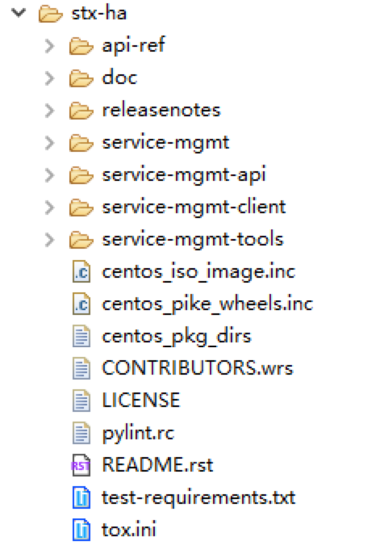
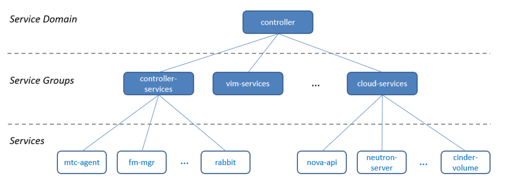
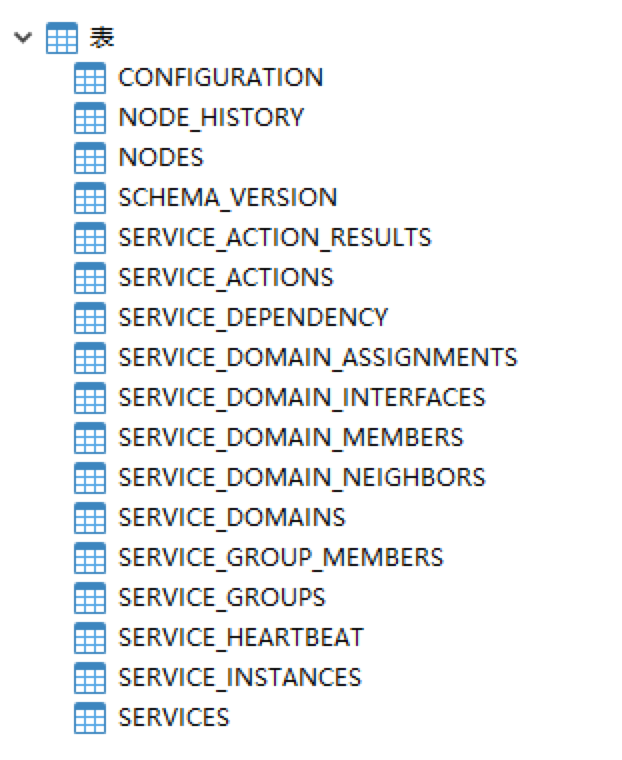
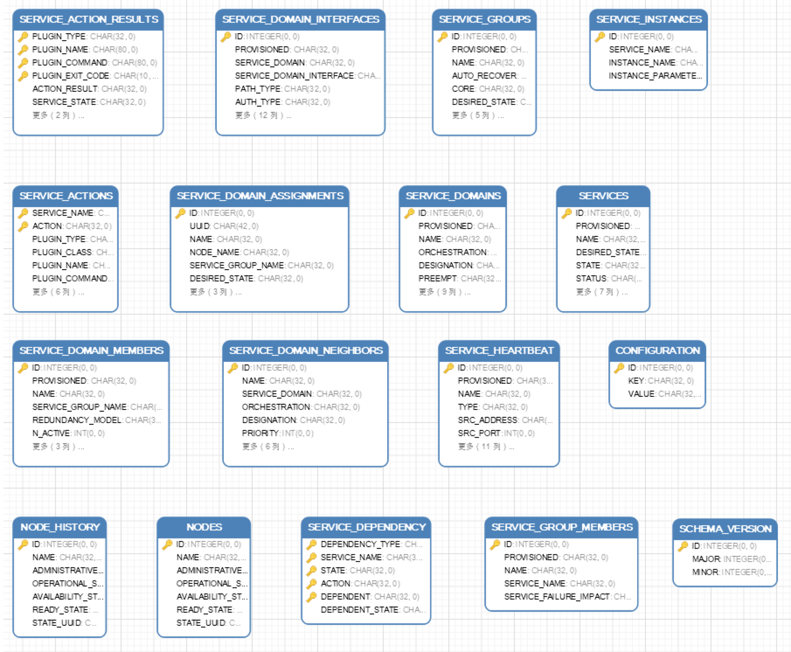
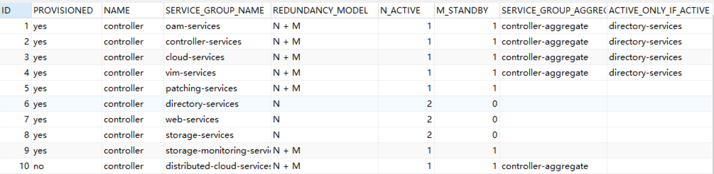
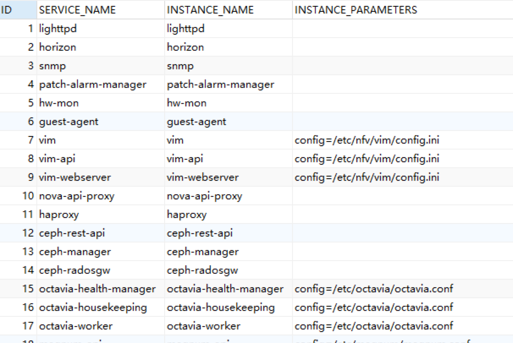
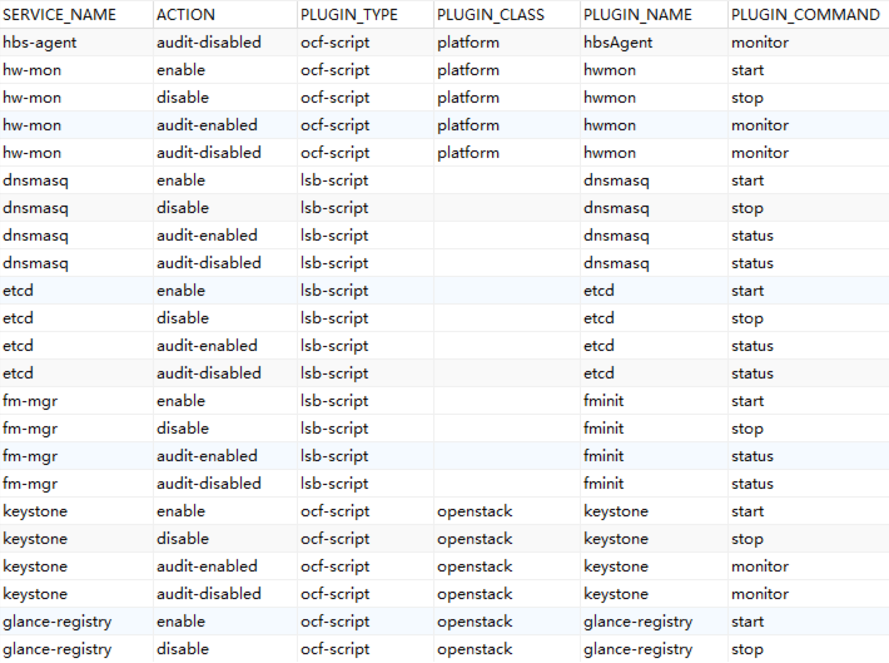
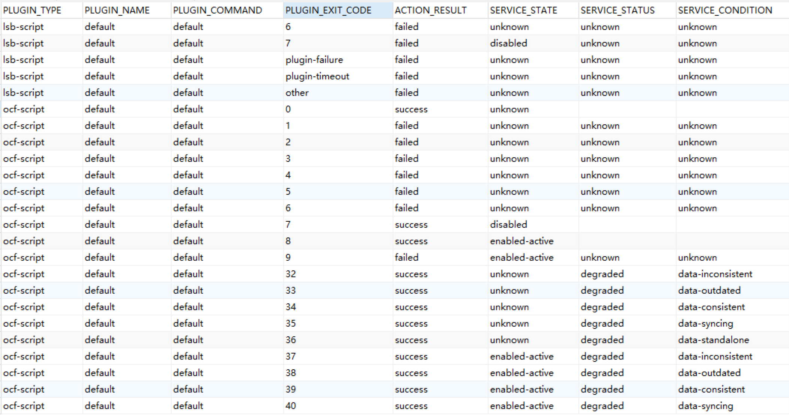
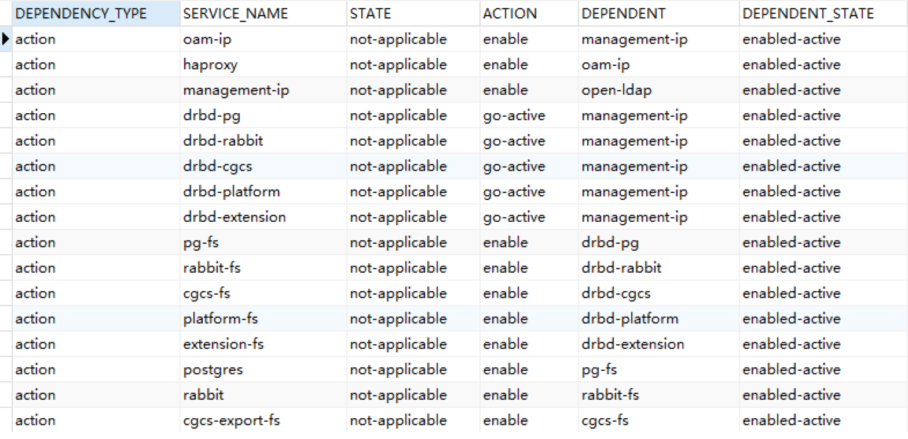

# 庖丁解牛——StarlingX 技术详解（3.1 stx-ha篇）

Author: WingWJ

Date: 17th, Feb, 2020

StarlingX version: 23rd, Jan, 2019


## 一、引言

之前我们已经已完成过 [stx-nfv](https://github.com/wingwj/wingwj.github.io/blob/master/sharing/starlingx/stx_nfv.md) 和 [stx-fault](https://github.com/wingwj/wingwj.github.io/blob/master/sharing/starlingx/stx_fault.md) 两个项目的解析，这一节来看stx-ha 项目。

计划分两节来介绍，第一部分是项目详解，第二部分是重要流程分析。


## 二、stx-ha project 详解

### 1. 项目概述

stx-ha project，主要由SM组件来承接。

同之前研究stx-nfv和stx-fault一样，先来看下官方的模块介绍：

```
High availability manager to manage the life cycle of services where the redundancy model can be N+M or N across multiple nodes:

  \- Currently used in StarlingX to provide 1+1 HA Controller Cluster.

Configured to use multiple messaging paths to avoid split-brain communication failures:

  \- Up to 3 independent communication paths.

  \- LAG can also be configured for multi-link protection of each path.

  \- Messages are authenticated using HMAC SHA-512 if configured / enabled on

   an interface-by-interface basis.

Active or passive monitoring of services.

Allows for specifying the impact of a service failure.

Completely data driven through the configuration of a SQL database.
```

可见，主要功能在主备场景下提供服务进程保护，为了避免通信脑裂而引入了SM。

 

### 2. 接口

除API version外，SM接口部分一共分了三个对象：services、service nodes、service groups。

可参见文件stx-ha/api-ref/source/api-ref-smapi-v1-ha.rst，或者直接看[官网](https://docs.starlingx.io/api-ref/stx-ha/api-ref-smapi-v1-ha.html)，一回事。这里不细说了。


此外，stx-ha服务端口是 7777。可以直接通过 OpenStack命令来查看其端点：

```
[root@controller-0]# openstack endpoint list |grep smapi

| ID                | Region  | Service Name | Service Type  | Enabled | Interface | URL                     |

| 1bbfbd837c15429882d2a6a6aefab249 | RegionOne | smapi    | smapi      | True  | admin   | http://192.168.63.2:7777          |

| cd6b715f736e4f478952009b145a2711 | RegionOne | smapi    | smapi      | True  | internal | http://192.168.63.2:7777          |

| ed3efadfc1e948ff95fd21fdf56ad9b2 | RegionOne | smapi    | smapi      | True  | public  | http://10.127.2.125:7777          |
```

 

### 3. 代码结构

IDE打开，代码结构如下：



 

分别来看下每个文件夹都包含了哪些内容：

- service-mgmt：SM组件核心内容；

- service-mgmt-api：对外提供SM API服务；

- service-mgmt-client：提供sm_client及CLI；

- service-mgmt-tools：提供sm_tools，可通过命令行来对SM进行管理配置。提供的命令脚本，可以在stx-ha/service-mgmt-tools/sm-tools/setup.py 中看到，如下：

  - sm-configure
  - sm-provision
  - sm-deprovision
  - sm-dump
  - sm-query
  - sm-patch
  - sm-manage
  - sm-unmanage
  - sm-restart-safe
  - sm-restart
  - sm-iface-state

这些命令在主机上也可以直接执行：

```
[root@controller-0 ~(keystone_admin)]# sm-dump

 

-Service_Groups------------------------------------------------------------------------

oam-services           active        active             

controller-services       active        active             

cloud-services          active        active             

patching-services        active        active             

directory-services        active        active             

web-services           active        active             

storage-services         active        active             

storage-monitoring-services   active        active             

vim-services           active        active             

\---------------------------------------------------------------------------------------

 

-Services------------------------------------------------------------------------------

oam-ip              enabled-active    enabled-active         

management-ip          enabled-active    enabled-active         

drbd-pg             enabled-active    enabled-active  

…
```


在控制节点上，通过ps 命令，也能查看到SM的相关进程：

```
controller-0:~# ps -ef|grep sm

root   26108   1 0 Feb22 ?    00:54:28 /usr/bin/sm-watchdog

root   26283   1 1 Feb22 ?    01:53:31 /usr/bin/sm

root   26284 26283 0 Feb22 ?    00:00:18 /usr/bin/sm

root   26295   1 0 Feb22 ?    00:10:59 /usr/bin/python2 /usr/bin/sm-api --config-file=/etc/sm-api/sm-api.conf --verbose --use-syslog --syslog-log-facility local1

root   26308   1 0 Feb22 ?    00:03:12 /usr/bin/sm-eru
```

 

### 4. 重要概念

在研究SM处理流程之前，这里先明确SM中的几个概念，分别是：

- **Service**：指整个系统中需要SM进行管理的各个服务。包括StarlingX各个管理服务，如fm-mgr；也包括OpenStack中其他业务服务，如nova-api、neutron-server等；（可参看上文sm-dump执行结果）
- **Service_group**：由功能接近的单个服务（Services）所组成的一个服务组。可以直接通过     SERVICE_GROUP_MEMBERS表来查询；（下文有专门分析。也可参看上文sm-dump执行结果）
- **Service_domain**：由各服务组，所组成的一个具有完整功能的服务域。环境默认为controller域。——这里其实和OpenStack中domain的概念很像。

所以，把这三者关系画在一起，关系一下就明白了：

 



有了以上基础，接着来看下SM的数据表结构。


### 5. 数据表

SM默认使用的是sqlite db，位置在/var/lib/sm/sm.db。

 ```
[root@controller-0 ~(keystone_admin)]# sqlite3 /var/lib/sm/sm.db 

sqlite> .databases

seq name       file                           

--- --------------- ----------------------------------------------------------

0  main       /var/lib/sm/sm.db                     

sqlite> .tables

CONFIGURATION        SERVICE_DOMAIN_ASSIGNMENTS

NODES            SERVICE_DOMAIN_INTERFACES 

NODE_HISTORY        SERVICE_DOMAIN_MEMBERS  

SCHEMA_VERSION       SERVICE_DOMAIN_NEIGHBORS 

SERVICES          SERVICE_GROUPS      

SERVICE_ACTIONS       SERVICE_GROUP_MEMBERS   

SERVICE_ACTION_RESULTS   SERVICE_HEARTBEAT     

SERVICE_DEPENDENCY     SERVICE_INSTANCES     

SERVICE_DOMAINS      

sqlite> select * from SERVICE_DOMAINS;

1|yes|controller|regional|unknown|no|230|200|800|5000|2000|initial|select-best-active||1

sqlite> 

sqlite> select * from SERVICE_DOMAIN_INTERFACES;

1|yes|controller|management-interface|primary|none||||ipv4-udp|239.4.2.1|192.168.63.3|2222|2223|192.168.63.4|2222|2223|tor

2|yes|controller|oam-interface|secondary|hmac-sha512|titanium-server|||ipv4-udp||10.127.2.126|2222|2223|10.127.2.127|2222|2223|tor

3|yes|controller|infrastructure-interface|secondary|none||||ipv4-udp|239.4.2.1|192.168.67.2|2222|2223|192.168.67.3|2222|2223|tor
 ```

用DB工具打开，SM全部数据表如下： 



 

为了直观的查看E-R图，这里用DB工具打开SM。然后发现，**SM DB里全部是单表，无任何关联。。**之前刚分析过，在那么清楚的三层数据结构下，还全部用name来对应关联。。弱爆了。。（*摊手*）



 

吐槽归吐槽，研究是研究。继续看看SM DB里还有些什么东西。


 #### 5.1 Service_Domain 相关表

首先是 SERVICE_DOMAIN_INTERFACES表，它展示的是service_domain间的交互接口。可见，**doamin间是通过三条路径进行通信的**，其中management-interface是主路径。这里引入多通路，是为了来避免异常时的脑裂问题。体现的正是在本篇开头中，组件官方介绍中写到的一点（"use multiple messaging paths to avoid split-brain communication failures"）：


 

这张是SERVICE_DOMAIN_MEMBERS表，里面除了定义了controller下附属的服务组，还明确了每个服务组的冗余方式（主备/多主），以及依赖关系：



以上，service_domain 相关表格看完了。


#### 5.2 Service_Group 相关表

而service_group的两张表，一张是定义环境中有哪些服务组（同上文中sm-dump结果），另一张定义了哪些service属于某个service_group，都比较简单，这里不列了。

 

#### 5.3 Service 相关表

下面具体来看看Service相关的几张表：

第一张SERVICES表，记录的是环境中有哪些服务（同上文中sm-dump结果），这里不列了；

第二张SERVICE_INSTANCES表，定义了各服务对应的具体运行的服务与配置。如下：



 

第三张 SERVICE_ACTIONS表，其实定义了各服务组件类型（分两类，lsb-script和ocf-script）、及对应参数。



 

这里先提一下lsb-script和ocf-script两种脚本。它俩其实是OS资源代理的两种常用形式（还有一种是ha resource）。分别来看：

- **LSB**：全称Linux Standards Base，指在OS的 /etc/init.d目录下的各脚本，提供个服务对应的start, stop, status, restart, reload等方法，具体脚本方法和操作系统有关。去环境上看下：

  ```
  controller-0:~# ls /etc/init.d/
  
  api-proxy     guestServer       netconsole          rmon
  
  ceph        haproxy         network            runservices
  
  ceph-init-wrapper hbsClient        neutron-bgp-dragent      sm
  
  ceph-manager    horizon         neutron-dhcp-agent      sm-api
  
  ceph-radosgw    host_agent       neutron-metadata-agent    sm-eru
  
  ceph-rest-api   hostw          neutron-server        sm-shutdown
  
  controller_config hwclock.sh       nfscommon           sm-watchdog
  
  dnsmasq      hwmon          nfsserver           snmpd
  
  drbd        i40e-lldp-configure.sh nova-compute         spawn-fcgi
  
  fm-api       influxdb        openldap           sshd
  
  fminit       lighttpd        openstack-ceilometer-polling sw-patch
  
  fsmon       logmgmt         patch-alarm-manager      sw-patch-agent
  
  functions     mlx4-configure.sh    pmon             sw-patch-controller
  
  gnocchi-api    mountnfs        qat_service          sw-patch-controller-daemon
  
  gnocchi-metricd  mtcalarm        qemu_clean          sysinv-agent
  
  goenabled     mtcClient        rbdmap            target
  
  guestAgent     mtclog         README            uexportfs
  ```

- **OCF**：全称Open Cluster Framework，这种资源代理提供标准实现，屏蔽了不同OS差异，脚本都在目录/usr/lib/ocf/resource.d/下，支持start, stop, status, monitor, meta-data等方法。

  片段示例如下。可见，这里还进行了分组，以platform为例，包含如下服务（注意对比，这里的StarlingX各服务，与lsb-script部分的脚本是不重复的哦）：

  ```
  controller-0:~# ll /usr/lib/ocf/resource.d/
  
  drwxr-xr-x. 2 root root 4096 Feb 25 07:31 heartbeat
  
  drwxr-xr-x. 2 root root 4096 Feb 25 07:22 linbit
  
  drwxr-xr-x. 2 root root 4096 Feb 25 07:32 nfv
  
  drwxr-xr-x. 2 root root 4096 Feb 25 07:32 openstack
  
  drwxr-xr-x. 2 root root 4096 Feb 25 07:32 platform
  
  drwxr-xr-x. 2 root root 4096 Feb 25 07:31 rabbitmq
  
  controller-0:~#
  
  controller-0:~# ll /usr/lib/ocf/resource.d/platform/
  
  -rwxr-xr-x. 1 root root 11856 Dec 26 06:14 guestAgent
  
  -rwxr-xr-x. 1 root root 15577 Jan 19 01:13 hbsAgent
  
  -rwxr-xr-x. 1 root root 13322 Jan 19 01:13 hwmon
  
  -rwxr-xr-x. 1 root root 14096 Jan 19 01:13 mtcAgent
  
  -rwxr-xr-x. 1 root root 7329 Dec 11 17:13 nfsserver-mgmt
  
  -rwxr-xr-x. 1 root root 11517 Jan 16 01:07 sysinv-api
  
  -rwxr-xr-x. 1 root root 9895 Jan 16 01:07 sysinv-conductor
  ```

   

SERVICE_ACTION_RESULT表，记录的是lsb-script和ocf-script两类服务，及各返回码对应的执行结果。片段如下：



最后一张，SERVICE_DEPENDENCY表中，记录了各服务对其他服务的依赖。片段如下： 




#### 5.4 小结

以上。SERVICES相关表分析，就已全部完成了。至此，SM DB也基本分析完了，这里先简单总结下：

- SM使用了三级数据模型；
- 通过分组来区分不同服务；
- 各服务启动相关参数、冗余方式、依赖项等，都有明确定义。


## 三、stx-ha 流程分析

接下来，来看看SM如何完成这些服务的组织与维护。先从SM自身的进程启动看起。

 

### 3.1 进程启动

SM的启动点，位于stx-ha/service-mgmt/sm-1.0.0/src/main.c。（*吐槽下，这SM又换用C写了。。别急，一会儿就用到C++了。。*） 

一起来看下启动过程：

- 环境配置：进程检测、设置pid文件、设置运行目录“/var/run/sm”、设置命令行参数、等待节点配置完成；

- 配置SM DB：包括主数据库“/var/run/sm/sm.db” 、心跳数据库“/var/run/sm/sm.hb.db”；

  - 读取主（master）数据库“/var/lib/sm/sm.db”的数据，写入“/var/run/sm/sm.db”DB中；
  - 执行sqlite命令：“PRAGMA      integrity_check;”来检查完整性。效果如下：
  - ```
    controller-0:~$ sqlite3 /var/lib/sm/sm.db 
    
    SQLite version 3.7.17 2013-05-20 00:56:22
    
    Enter ".help" for instructions
    
    Enter SQL statements terminated with a ";"
    
    sqlite>
    
    sqlite> PRAGMA integrity_check;
    
    ok
    
    sqlite>
    ```


- 执行db补丁脚本：“cat /var/lib/sm/patches/sm-patch.sql | sqlite3 /var/run/sm/sm.db 2>&1”

- 执行数条sqlite3命令来完成DB构建，创表过程也在这里。想看细节的在这里找：stx-ha/service-mgmt/sm-db-1.0.0/src/sm_db.c 中的sm_db_build()。

- 确定部署模式：确定是 AIO、AIO simplex、AIO duplex 三者中的哪种模式。方式是通过直接读取平台配置文件platform.conf 来确定的。如下，示例环境为duplex模式：

  ```
  controller-0:~# cat /etc/platform/platform.conf 
  
  nodetype=controller
  
  subfunction=controller
  
  system_type=Standard
  
  security_profile=standard
  
  management_interface=enp2s0f0
  
  INSTALL_UUID=e8321866-071a-4321-877a-6e3053861f76
  
  sdn_enabled=no
  
  region_config=no
  
  sw_version=18.11
  
  security_feature="nopti nospectre_v2"
  
  UUID=5747345d-643d-41f8-afa9-44f31210e92e
  
  oam_interface=enp2s0f1
  
  infrastructure_interface=enp2s0f3
  
  system_mode=duplex
  
  vswitch_type=ovs-dpdk
  ```

  

  *注：我又要吐槽了。。看代码，这里写的判断方法好蠢。。几乎相同作用的函数（sm_node_utils_is_aio()、sm_node_utils_is_aio_simplex()、sm_node_utils_is_aio_duplex()）连续跑了三次，其实读取一次就能判断出结果。。*

 

- 进程初始化。只列重点：

  - 初始化了一堆模块和线程，如 hw、msg、alarm、log等；

  - 注册心跳检测线程。通过创建一组（8个）心跳线程“sm_heartbeat”来进行心跳保持（0.4s异常后警告，3s后失败）；

  - 初始化心跳检测线程，注册对应的callback函数，与对端通过socket方式来保持心跳（代码流程很长）。

  - 注：如果是 aio_simplex模式，则无需启动心跳检测；

  - sm_process_death_initialize

  - DB初始化（这个时候还没真正干活）；

  - 下面连续初始化各组件。除了初始化各对象的对应表之外，其中关键的步骤，是其中的 fsm（有限状态机）初始化方法（如node_fsm、service_domain_fsm等）。fsm()会注册各个组件的callback函数，用于响应各类消息（比如node callback中node_hello、node_update、node_swact；service_domain      callback的hello、service_domain_neighbor callback的hello、pause、exchange、exchange_start，service callback的okay、warn、degrade、fail 等），而这些callback函数中会有具体的event_handler() 来处理。比如fsm_event_handler()，它会根据service_domain表中记录的service_domain的具体状态，走不同的处理分支。

  - 按照顺序，包含：

    - Node
    - service_domain
    - service_domain_neighbor
    - service_domain_interface
    - service_group
    - service

  - nova_api 初始化：node_fsm 初始化，注册callback函数（node_hello、node_update、node_swact）；

  - service_domain_api 初始化：

    - 初始化对应表；
    - service_domain_fsm：注册callback函数（hello）。回调函数中包含fsm_event_handler()，它会根据service_domain表中记录的service_domain的具体状态，走不同的处理分支；
    - service_domain_neighbor_fsm：基本同上，注册callback函数（hello、pause、exchange、exchange_start），初始化event_handler；
    - 初始化service_domain_scheduler：
    - sm_service_domain_interface_fsm_register_callback：

  - service_domain_interface_api：fsm

  - sm_service_group_api_initialize：fsm

  - sm_service_action_initialize：数据表

  - sm_service_api_initialize：fsm

  - sm_service_heartbeat_api_initialize：初始化心跳socket；

  - sm_failover_initialize

  - sm_service_heartbeat_thread_start：启动服务心跳线程；

  - sm_main_event_handler_initialize：启动API。

  - 如果是aio_duplex模式，sm_task_affining_thread_start

- 设置启动完成标志位：通过“/var/run/sm_boot_complete”来标示。

 

至此，SM服务启动完成。


### 3.2 进程保护

（*#TBD*）


## 四、后记

*“等下，怎么还没写完就后记了。。”*

其实，这篇stx-ha 分析，早在2019年初就完成了。但因为一些人和事的原因，导致一直没发出来。后续由于工作内容调整及连续几个月的加班工作，导致这里一直也没补上（*借口。。*），拖延至今。

当前StarlingX 都已经发布到[3.0版本](https://docs.starlingx.io)了。虽然整体来说还是没有太大改动，但对于之前写文章时使用的2019.01版本来说变化还是不少。说实话，有点不知道要不要补（同理，也包括StarlingX 的剩余内容）。。

之前也犹豫过这篇还要不要发。后面想明白了，这些也是自己一路以来的成长点滴，还是发出来吧。在整理这篇文章的时候，也回想起了之前分析StarlingX 时的一些场景。说不定后续哪天心血来潮，回来把所有的内容都补上了呢。。：）

