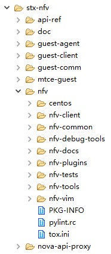
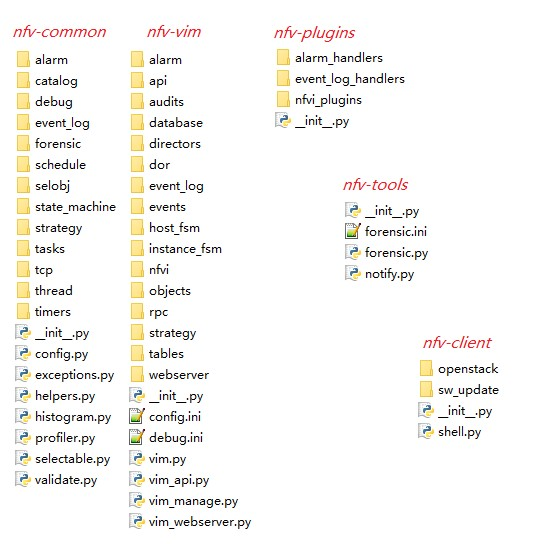
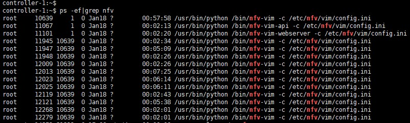
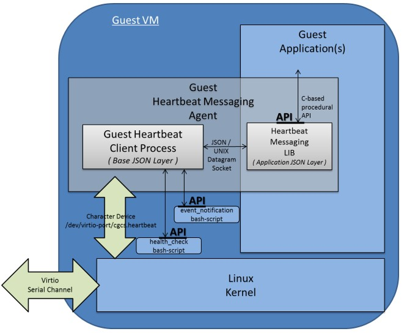
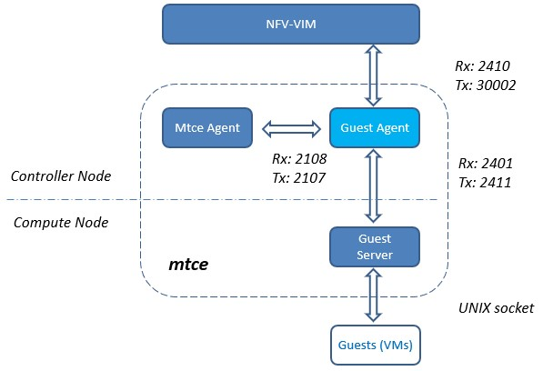
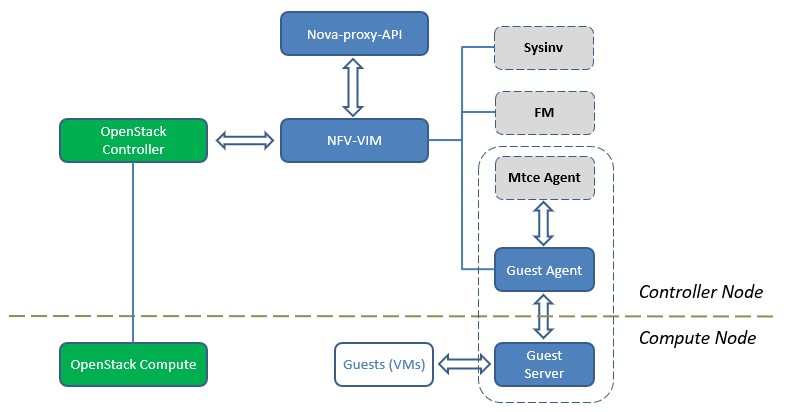

# 庖丁解牛——StarlingX技术详解（1. stx-nfv篇）

Author: WingWJ

Date: 30th, Jan, 2019

StarlingX version: 23th, Jan, 2019


## 一、引言

最近开始看StarlingX。

去年底在柏林峰会上，看到不少和边缘计算等相关的议题，各种公众号之类也吵嚷的火热。相关开源项目也有不少，比如Red Hat的VCO（Virtual Central Office）、Linux基金会下的Akraino、OpenStack基金会的StarlingX、RedHat贡献给OPNFV的vCO等。但从业界来看，似乎当前还处于雷声大雨点小的状态，但从各大厂商都在开源抢占标准，加上5G的东风，可见业界还是很看好这个方向的。临渊羡鱼，不如退而结网。亲自看看吧！就先从OCF的StarlingX开始。

但去网上找了找资料，发现有关StarlingX的还多是宣传水贴，有价值的干货很少，在网络上找了半天也没见到一篇像样的。所以，还是自己来吧，边学边写。

另外，StarlingX是由一套巨大的私有系统开源而来的，除了正常的云平台逻辑外，提供了从安装部署、主机管理、故障处理、升级补丁等多全方面内容。所以，本系列计划以逐个拆解的方式，来将各个子系统/项目分开来解析，最后得到一份完整的拼图。这也是本文标题的由来。


## 二、StarlingX 简介

StarlingX最早起源于Wind River Titanium Cloud R5，由Intel和风河贡献给OCF社区。在2018柏林峰会前刚发布了第一个正式版本。StarlingX是OCF的一个独立项目，不是OpenStack的子项目，它基于OpenStack构建了一个完整的云基础架构软件堆栈，适用于IoT（物联网），电信，自动驾驶，AR/VR/高清视频传输等对性能/延迟有较高要求的场景。当前边缘计算的玩法，是把计算和存储资源部署在网络边缘，通过智能终端、5G等新兴技术结合，来把计算量从中心云卸载到边缘云上，以解决延迟与性能的问题。

有关5G各种应用场景、使用特征、需求分析等，不是本文重点。本文只聚焦于StarlingX技术实现本身。

先来看下StarlingX的架构图：


StarlingX基于OpenStack各组件，对上层提供了一套对象抽象来方便上层编排；而下层则结合当前云计算领域最流行的各项技术，如libvirt、OVS、DPDK、Ceph、K8s等。此外，StarlingX还提供了很多中间件如软件管理、故障管理、服务管理等功能，提供了更丰富的管理能力。


上图中，列举了StarlingX涉及的各个项目（project），分为主要项目及支持项目两类。其中重要的为上面的八个，对应各个项目名，分别提供了以下功能：

-   stx-config：负责节点软件的安装和配置；

-   stx-fault：负责故障的监测、收集、上报、处理；

-   stx-ha：负责节点、服务、虚拟机的HA；

-   stx-gui：StarlingX专门提供了专门的Portal，基于Horizon；

-   stx-metal：管理物理服务器资源；

-   stx-nfv： 提供NFVI Orchestration功能。是整个StarlingX项目的核心，串联起了整个项目；

-   stx-update：负责软件升级、回退，打补丁；

-   stx-distcloud：负责通过dcmanager对各边缘云进行中心管理。

这么多内容，该从哪里下手开始入门呢？当然要从最关键部件开始。：）

以下将从stx-nfv project开始，先完成这个中心项目的学习，然后将触角逐步延伸，逐个将它涉及的其他部件添加进来，最终构成一张完整的StarlingX技术地图。

*注：以下分析均基于OpenStack社区StarlingX 项目 2019-01-23日版本。*


## 三、STX-NFV Project 详解

作为StarlingX 与 OpenStack 交互中间件，stx-nfv主要提供NFVI Orchestration功能，此外还负责VM故障恢复及主机补丁升级。

这里先看下stx-nfv的功能列表。以下是官方定义：

-   Responsible for managing and orchestrating the VM carrier grade and high availability capabilities,

-   Auto-healing of failed instances

-   Orchestrates guest API actions

-   Raising and clearing operator alarms about instances. Generating operator logs about instances

-   Orchestrates the migration of instances off compute hosts being taken administratively out of service

-   Orchestrates software patching and upgrades of hosts

### 1. 项目概述

整个stx-nfv项目，包含 nfv、guest-agent/server、nova-api-proxy 三大功能：



 

### 2. NFV

其中最关键的部件为 nfv，代码结构大致如下。简单看下几个模块的代码名，就能了解到它们提供的功能：



这里能看到nfv有关的全部进程：



以下，重点介绍下nfv各组件的主要功能。各模块功能介绍如下，其中作为独立进程启动的只有前三个：

-   nfv-vim-api：整个nfv-api模块基于Pecan轻量级框架，对外提供api，端口号4545。除了提供类似OpenStack资源的访问接口外，还提供了补丁策略、升级策略 的接口（这一部分在后续介绍 stx-update project时再具体说 *\#TODO*）；

    ```
    controller-1:~# netstat -tlunp |grep 4545
    tcp        0      0 192.168.121.2:4545      0.0.0.0:*               LISTEN      11067/python 
    tcp        0      0 10.127.2.145:4545       0.0.0.0:*               LISTEN      6455/haproxy
    controller-1:~# ps -ef |grep 6455
    haproxy   6455     1  0 Jan18 ?        00:00:39 /usr/sbin/haproxy -D -f /etc/haproxy/haproxy.cfg -p /var/run/haproxy.pid
    controller-1:~# cat /etc/haproxy/haproxy.cfg |grep 4545
      bind 10.127.2.145:4545  
      server s-vim-restapi 192.168.121.2:4545
    controller-1:~# ps -ef|grep 11067
    root     11067     1  0 Jan18 ?        00:02:20 /usr/bin/python /bin/nfv-vim-api -c /etc/nfv/vim/config.ini
    ```

    在nfv\_vim/api/controllers/v1/\_controller.py 里指定了三类端口，并将端口与各对象对应起来：

    | 一级URL                      | 二级URL       | 三级URL     | 说明           |
    | -------------------------- | ----------- | --------- | ------------ |
    | /                          | -           | -         |              |
    | /api                       | -           | -         |              |
    | /api/openstack             | -           | -         | OpenStack类接口 |
    |                            | /heat       | -         |              |
    | /api/orchestration         | -           | -         | 软件管理类接口      |
    |                            | /sw-patch   | -         |              |
    |                            | /sw-patch   | /strategy | 补丁策略         |
    |                            | /sw-upgrade | -         |              |
    |                            | /sw-upgrade | /strategy | 升级策略         |
    | /api/virtualised-resources | -           | -         | 虚拟化资源类接口     |
    |                            | /computes   | -         |              |
    |                            | /networks   | -         |              |
    |                            | /images     | -         |              |
    |                            | /volumes    | -         |              |

    有关补丁+升级策略，可以直接不指定三级URL，发GET请求到对应地址就能查询到。具体接口参数及body体，也可以在工程中查询：stx-nfv/api-ref/source/api-ref-nfv-vim-v1.rst。

    注意：这里多说一句，nfv-vim层其实不光只进行消息转发，它自身是维护有主机及虚拟机的状态管理的；一个VM操作从nfv-vim-api发进来，是会同步更新nfv-vim中的状态的。有关主机及虚拟机的状态机，分别定义在stx-nfv/nfv/nfv-vim/nfv\_vim/instance\_fsm/ 和 stx-nfv/nfv/nfv-vim/nfv\_vim/host\_fsm/ 路径下。另外，rpc消息与各对象的对应，都在rpc和objects文件夹里定义，不多写了。


-   nfv-vim（nfvi）：stx-nfv 组件核心模块，串联管理整个组件；

    查看 nfv\_vim/api/openstack/\_objects.py 看下nfv-vim内涉及的模块。

    ```
    class OpenStackServices(Constants):
        """
        OpenStack Services Constants
        """
        CEILOMETER = Constant('ceilometer')
        CINDER = Constant('cinder')
        GLANCE = Constant('glance')
        GUEST = Constant('guest')
        KEYSTONE = Constant('keystone')
        MTC = Constant('mtc')
        NEUTRON = Constant('neutron')
        NOVA = Constant('nova')
        SYSINV = Constant('sysinv')
        HEAT = Constant('heat')
    ```

    在nfvi.pp（默认配置在另一个stx-config project中，路径为 stx-config/puppet-modules-wrs/puppet-nfv/src/nfv/manifest/nfvi.pp）中，配置了多个服务对应的监听端口，分别是（通过进程启动日志看的更容易）：

    ```
    $infrastructure_rest_api_host  = '127.0.0.1',
    $infrastructure_rest_api_port  = 30001,
    $guest_rest_api_host           = '127.0.0.1',
    $guest_rest_api_port           = 30002,
    $compute_rest_api_host         = '127.0.0.1',
    $compute_rest_api_port         = 30003,
    $host_listener_host            = '127.0.0.1',
    $host_listener_port            = 30004,
    ```

    其中，比较关键的与云平台通信的服务端口号是 30003，包含多个子进程： 

    ```
    controller-1:~# netstat -tlunp |grep 30003
    tcp        0      0 127.0.0.1:30003         0.0.0.0:*               LISTEN      10639/python
    controller-1:~# ps -ef|grep 10639
    root     10639     1  0 Jan18 ?        01:29:41 /usr/bin/python /bin/nfv-vim -c /etc/nfv/vim/config.ini
    root     11945 10639  0 Jan18 ?        00:03:52 /usr/bin/python /bin/nfv-vim -c /etc/nfv/vim/config.ini
    	…… (skip other 8 sub-process)
    root     12268 10639  0 Jan18 ?        00:03:02 /usr/bin/python /bin/nfv-vim -c /etc/nfv/vim/config.ini
    ```


-   nfv-vim-webserver：监听32323对外提供了一个简单的http-server。主要逻辑在 stx-nfv/nfv/nfv-vim/nfv\_vim/webserver/\_webserver.py 里，（通过database）获取主机、主机组、卷、镜像、系统概述、告警（通过fm获取的）等各统计信息：

    ```
    controller-1:~# netstat -tlunp |grep 32323
    tcp        0      0 10.127.2.145:32323      0.0.0.0:*               LISTEN      11101/python 
    controller-1:~# ps -ef|grep 11101
    root     11101     1  0 Jan18 ?        00:02:21 /usr/bin/python /bin/nfv-vim-webserver -c /etc/nfv/vim/config.ini
    ```

-   nfv-vim-manage：读写数据库命令行工具，包含在nfv-vim进程内。主要逻辑在nfv-vim/database/\_database.py中，俩功能dump-data（获取）和load-data（上传commit）；

    ```
    controller-1:~# nfv-vim-manage -h
    usage: nfv-vim-manage <command> [<args>] 
      where command is one of 
        db-dump-data    dump data from database 
        db-load-data    load data into database 
     
    positional arguments:
      command     command to be run
     
    optional arguments:
      -h, --help  show this help message and exit
    ```

-   nfv-common：公共组件；状态机管理是在这里定义的（看上面代码结构图）；

-   nfv-plugins：插件层。一共提供了三个API转发功能（看上面代码结构图），分别是：

    -   与FM通信的告警处理、事件日志管理，这一部分留待后文介绍 stx-fault project 时具体说。*\#TODO*；

    -   以及与nfvi层的通信插件。包含与sysinv的通信接口，和OpenStack通信的插件层。

-   nfv-tools：只看代码名似乎看不出来它的功能。它其实是提供了一个进程配合nfv-common的forensic代码（核心逻辑在\_analysis.py中）用来解析nfv-vim.log，通过对文件的具体解析，来确认VM事件的执行结果。


### 3. Guest Agent

在stx-nfv project中第二部分功能，是有关Guest Agent的。这一部分主要是用C及C++编写的。

接下来看下 Guest Agent的功能。它其实与原生的Guest Agent没太大区别，都是通过UNIX socket在VM与hypervisor间打开一条通信渠道，让VM内的消息能传出去，VM外的指令能发进来；消息以 json格式传递。具体原理可以查看这里：*http://www.linux-kvm.org/page/Virtio-serial_API* 。说到与原生的区别，主要是针对StarlingX的逻辑，又做了一些消息的额外传递&处理；类似的通信功能都是通过这条通道来实现的。当前主要提供了三大功能：

-   心跳服务（Heartbeat Service）；

-   资源缩放（Resource Scaling）；

-   虚拟机组（Server Group）。


 

在实现上，以心跳检测为例：

-   通过nfv-vim 创建VM时，在flavor.extra\_spec中，指定启用Heartbeat功能——"sw:wrs:guest:heartbeat=True"（默认false）；

-   VM启动的时候，会创建一个UNIX socket通道（模拟virtio-pci设备），并且在启动时会运行heartbeat\_init脚本来启动heartbeat进程来进行周期性上报。注意，在初始化部分，就会设置好Guest通信中断后的处理措施——log、stop、reboot；

-   在各计算节点上，有Guest Server（由pmon管理） 通过UNIX socket传递TCP信息（“challenge”），来与VM通信；一旦超时，则按照初始化时指定的措施来执行（如reboot）；

    -   基于该通道，可以用脚本完成健康监测（health check）、事件通知（event\_notification）等附加功能；

    -   此外，部分VM操作也会经由这条通道通知到Guest 做预处理。如stop、reboot、冷热迁移等，可以看这里描述：stx-nfv/guest-client/guest-client-3.0.1/README.usage；

-   在控制节点的Guest Agent进程（由SM管理）作为总控，作为心跳控制器及事件代理。具体功能看下面注释：

    -   HTTP命令接收器：VIM向其发送实例控制命令；

    -   HTTP事件发送器：守护程序可以将实例失败事件和状态查询命令发送到VIM；

    -   状态查询审核

-   VIM能够启用和禁用心跳故障报告，以及在心跳故障时采取客户指定的纠正措施。



 

在代码包中，官方还附了一份pdf文档，来说明该心跳检测的原理，可以查看这里：stx-nfv/guest-client/guest-client-3.0.1/TiS-Guest-Heartbeat-Service.pdf。

 此外，StarlingX中利用Guest Agent 的通道，还实现了另外两个功能，分别是资源调整及Server Group：

-   资源调整：当前只支持vCPU调整，实现也是使用了该通道。工程中其实专门附了个说明文档，来说明vCPU调整的功能原理，pdf里面把整个VM-Host的通道路径都做了详尽描述。想看的同学可以在该路径下找到该pdf：stx-nfv/guest-agent/guest-scale-agent-2.0/docs/TiS-Guest-Resource-Scaling.pdf；

-   Server Group：该功能与Nova的概念不同（可配合使用）。它的作用范围为同在一个Group内的各Guest（VM），对于同组内的VM，能借助该通道，实现组间Guest 状态感知及广播/通知。该渠道不直接依赖于IP网络，组内VM也不需要其它显式的感知组内其他成员，使得组间VM能够获取组内其他VM的状态信息，用于业务的后续决策。具体可参考工程中pdf说明：stx-nfv/guest-comm/host-guest-comm-2.0/docs/TiS-Guest-Server-Group-Messaging.pdf。

这里，顺带着把 mtce也先提一下。mtce是maintenance的简写，它是stx-metal project 的核心，主要用来完成环境节点状态维护、进程保护、资源上报等功能。上文中介绍的Guest Agent 及Guest Server 都是mtce的一部分，而mtce Agent是mtce的管理中心。有关这部分内容，后续会介绍，到时一并补完。*\#TODO*

下图以Guest Agent为视角，罗列了它与其他组件的协作关系：



 

### 4. Nova-Proxy-API

最后，在stx-nfv project 中，还额外扩展了一个proxy组件称为nova-proxy-api，作为分发器，主要用来进行请求转发。因为有些消息（如VM的常用操作）需要传递到nfv模块中（以同步下发），而有些消息则可以直接发往Nova去。来看下真实环境： 

```
controller-1:~# ps -ef|grep nova-api-proxy
root     31196     1  0 Jan19 ?        00:04:23 /usr/bin/python /usr/bin/nova-api-proxy --config-file=/etc/proxy/nova-api-proxy.conf
```

我们再看下配置文件里的内容，除了鉴权信息外，最重要的是 一进两出 的端口信息：

```
controller-1:~# cat /etc/proxy/nova-api-proxy.conf
[DEFAULT]
api_paste_config=api-proxy-paste.ini
auth_strategy=keystone
debug=False
show_request_body=False
pool_size=256
osapi_proxy_listen=192.168.121.2
osapi_proxy_listen_port=8774
osapi_compute_listen=192.168.121.2
osapi_compute_listen_port=18774
nfvi_compute_listen_port=30003
nfvi_compute_listen=127.0.0.1
 
[keystone_authtoken]
admin_user=nova
admin_tenant_name=services
...
```

这个服务通过api\_proxy.py::main()启动，流程与其他OpenStack服务类似，比较简单。这里不列了。

最关键的逻辑，其实是在 nova-api-proxy/acceptor.py 里定义的。即如果操作是POST类型且操作类型在列表里时，这些操作需要先路由到nfvi 去。否则直接发往OpenStack Nova去。——简单概括下，即nfvi 把需要转发的消息，事先在nova-api-proxy里注册了。

 

### 5. 小结

本章最后，把本文中涉及的各组件画到一起，如下：



其中组件sysinv（stx-config相关）、FM（stx-fault相关）、mtce Agent（stx-metal相关），由于只在本文流程中涉及还没开始展开，所以暂时以虚线标注，等后续介绍时再逐步填充进去，最终组成一张完整的技术地图。


## 四、一点想法

本文最后，其实还想吐槽下StarlingX的组件结构。

- 由于它是从Wind River之前的私有化产品而来，所以里面很多功能并不是按照完整的独立模块来提供的，导致耦合很大，这也是社区之前对于StarlingX项目颇有微词的地方。目前StarlingX已按照功能拆分为各个project，但还是存在某个组件横跨多个project的场景。

- 此外，为了满足其业务诉求，Wind River Titanium Cloud还在原生OpenStack上进行了大量的私有改动，其中以Nova（已分析过源码，改动非常大）、Neutron两个模块居多，这一部分社区也已要求进行解耦，最终和社区版本融合。

以上。这篇就先写到这里，剩余的组件边看边写，估计得到年后更了。